**National Coastal Drone Program**

**Field Manual**

**Deakin University**

This document has been prepared by Dr Blake Allan and Dr Daniel
Ierodiaconou from Deakin University, Victoria Australia, as a field
manual for drone operations for the National Coastal Drone Program
(NCDP). The NCDP will enhance our capability to monitor coastline change
in the critical land-sea interface on a national-scale where 85% of
Australian population resides. We have developed a national-scale
coastline monitoring program utilising low-cost data collection methods
to complement the implementation of the Coastal Reference Sites (CRSs).

Data collection involves the use of citizen scientists and local
expertise flying low-cost drones in the Civil Aviation safety Authority
(CASA) RPA Excluded category (\< 2 kg) and incorporating RTK technology
to build a timeseries of survey-grade data for coastlines. These data
are used to produce centimetre-accurate orthomosaics and digital surface
models for 3-5 km sections of coast as a time series. These outputs can
then be related to data from CRSs (e.g. waves) and analysed through time
to quantify volumetric change and trends. Drones also provide the
ability to undertake event-based sampling following events such as
storms where great magnitudes of change can occur.

The NCDP Field Manual outlines the equipment, set-up, mission planning
techniques, operational techniques, and other useful information and
materials for undertaking coastal drone monitoring. The documentation is
based on the learnings and development of the Victorian Coastal
Monitoring Program which has been operating since 2018 and has
successfully collected over 1,400 datasets through a combination of
scientists, citizen scientists, and local land managers following these
techniques. While written for the National Coastal Drone Program, the
information is relevant to any organisation wishing to undertake drone
operations, and wherever possible we have included justifications for
decisions regarding aspects such as equipment choice, flying heights,
overlap percentages, etc. This resource, and the NCDP Training Syllabus
are free to any who may find it useful.

<table>
<colgroup>
<col style="width: 47%" />
<col style="width: 5%" />
<col style="width: 47%" />
</colgroup>
<thead>
<tr class="header">
<th>
<strong>Dr Blake Allan</strong>

National Coastal Drone Program Scientific Lead

Deakin University 

<a
href="https://deakin365.sharepoint.com/sites/NationalCoastalDroneProgram/Shared%20Documents/General/NCDP_Admin/Training%20Manual/b.allan@deakin.edu.au">b.allan@deakin.edu.au</a>
</th>
<th></th>
<th>
<strong>Dr Daniel Ierodiaconou</strong>

Professor, CoastRI lead scientist

Deakin University

<a
href="https://deakin365.sharepoint.com/sites/NationalCoastalDroneProgram/Shared%20Documents/General/NCDP_Admin/Training%20Manual/daniel.ierodiaconou@deakin.edu.au">daniel.ierodiaconou@deakin.edu.au</a>
</th>
</tr>
</thead>
<tbody>
</tbody>
</table>

# Table of Contents

[Introduction [4](#introduction)](#introduction)

[How It Works – National Coastal Drone Program
[4](#how-it-works-national-coastal-drone-program)](#how-it-works-national-coastal-drone-program)

[Equipment – RTK Drone [5](#equipment-rtk-drone)](#equipment-rtk-drone)

[Mapping a New Site [6](#mapping-a-new-site)](#mapping-a-new-site)

[Before Mapping Commences
[7](#before-mapping-commences)](#before-mapping-commences)

[Initial Drone Set-Up and Settings – DJI Matrice 4 Enterprise
[8](#initial-drone-set-up-and-settings-dji-matrice-4-enterprise)](#initial-drone-set-up-and-settings-dji-matrice-4-enterprise)

[Grid Missions [12](#grid-missions)](#grid-missions)

[‘Mapping Area’ [12](#mapping-area)](#mapping-area)

[‘Main Settings Screen – First Pass’
[12](#main-settings-screen-first-pass)](#main-settings-screen-first-pass)

[‘Advanced Settings’ [13](#advanced-settings)](#advanced-settings)

[‘Main Settings Screen – Second Pass’
[14](#main-settings-screen-second-pass)](#main-settings-screen-second-pass)

[Linear Missions [15](#linear-missions)](#linear-missions)

[Linear Mission 01 – 60 m Flying Height
[15](#linear-mission-01-60-m-flying-height)](#linear-mission-01-60-m-flying-height)

[Linear Mission 02 – 80 m Flying Height
[17](#linear-mission-02-80-m-flying-height)](#linear-mission-02-80-m-flying-height)

[Oblique Missions [18](#oblique-missions)](#oblique-missions)

[“Route” Tab – First Pass
[18](#route-tab-first-pass-1)](#route-tab-first-pass-1)

[“Waypoint” Tab [19](#waypoint-tab-1)](#waypoint-tab-1)

[“Route” Tab – Second Pass
[19](#route-tab-second-pass-1)](#route-tab-second-pass-1)

[Importing a Flight Route
[20](#importing-a-flight-route)](#importing-a-flight-route)

[Conducting Mapping [21](#conducting-mapping)](#conducting-mapping)

[Step 01 – Arrival to Site
[21](#step-01-arrival-to-site)](#step-01-arrival-to-site)

[Step 02 – Setting Out the AeroPoints
[21](#step-02-setting-out-the-aeropoints)](#step-02-setting-out-the-aeropoints)

[Step 04 – Setting Up the drone
[23](#step-04-setting-up-the-drone)](#step-04-setting-up-the-drone)

[Step 05 – Operating the drone
[23](#step-05-operating-the-drone)](#step-05-operating-the-drone)

[Additional Information for Linear and Oblique Missions
[25](#additional-information-for-linear-and-oblique-missions)](#additional-information-for-linear-and-oblique-missions)

[Step 06 – Packing Down the drone
[26](#step-06-packing-down-the-drone)](#step-06-packing-down-the-drone)

[Step 07 – End of Mapping
[26](#step-07-end-of-mapping)](#step-07-end-of-mapping)

[Data Upload [27](#data-upload)](#data-upload)

[Imagery Upload
[27](#imagery-upload---final-method-still-in-development)](#imagery-upload---final-method-still-in-development)

[AeroPoint Upload [27](#aeropoint-upload)](#aeropoint-upload)

[AeroPoint Charging [28](#aeropoint-charging)](#aeropoint-charging)

[Additional Data Capture Techniques
[29](#additional-data-capture-techniques)](#additional-data-capture-techniques)

[Accident or Incident Reporting
[30](#accident-or-incident-reporting)](#accident-or-incident-reporting)

[APPENDIX [30](#appendix)](#appendix)

[**Airframe Checklist DJI Matrice 4 Enterprise –
\_\_\_\_\_\_\_\_\_\_\_\_\_\_\_\_\_\_\_\_\_\_\_\_**
[31](#_Toc235777049)](#_Toc235777049)

[**Drone Operation Safety Briefing**
[32](#drone-operation-safety-briefing)](#drone-operation-safety-briefing)

[**National Coastal Drone Program**
[33](#national-coastal-drone-program)](#national-coastal-drone-program)

[**Drone Mapping Checklist**
[33](#drone-mapping-checklist)](#drone-mapping-checklist)

[NCDP Defect and Maintenance Log
[34](#ncdp-defect-and-maintenance-log)](#ncdp-defect-and-maintenance-log)

[NCDP Time in Service Log
[35](#ncdp-time-in-service-log)](#ncdp-time-in-service-log)

[NCDP Daily Sheet [36](#ncdp-daily-sheet)](#ncdp-daily-sheet)

[**Activity Attendance Register for Volunteers**
[37](#_Toc235777056)](#_Toc235777056)

[**Job Safety Plan for Volunteer Activities**
[38](#job-safety-plan-for-volunteer-activities)](#job-safety-plan-for-volunteer-activities)

[NCDP Risk Assessment
[45](#ncdp-risk-assessment)](#ncdp-risk-assessment)

[Birdlife Australia Advice for Drone Operations in Coastal Areas
[52](#birdlife-australia-advice-for-drone-operations-in-coastal-areas)](#birdlife-australia-advice-for-drone-operations-in-coastal-areas)

[NCDP Quick Reference Sheet
[53](#ncdp-quick-reference-sheet)](#ncdp-quick-reference-sheet)

[Weather and tides [53](#weather-and-tides)](#weather-and-tides)

[AeroPoints [53](#aeropoints)](#aeropoints)

[Missing Missions [53](#missing-missions)](#missing-missions)

[Compass Calibration [54](#compass-calibration)](#compass-calibration)

[Grid Vs Linear Missions
[54](#grid-vs-linear-missions)](#grid-vs-linear-missions)

[Oblique Missions [54](#oblique-missions-1)](#oblique-missions-1)

[Minimum Number of Citizen Scientists
[54](#minimum-number-of-citizen-scientists)](#minimum-number-of-citizen-scientists)

[What if the AeroPoint Light Isn’t On When I Go To Pick It Up?
[54](#what-if-the-aeropoint-light-isnt-on-when-i-go-to-pick-it-up)](#what-if-the-aeropoint-light-isnt-on-when-i-go-to-pick-it-up)

[Battery Limits [55](#battery-limits)](#battery-limits)

[Incident and Accident Response
[55](#incident-and-accident-response)](#incident-and-accident-response)

[Personal Hotspot [55](#personal-hotspot)](#personal-hotspot)

[The transmitter is beeping constantly after turning it on.
[55](#the-transmitter-is-beeping-constantly-after-turning-it-on.)](#the-transmitter-is-beeping-constantly-after-turning-it-on.)

[The drone keeps stopping and starting along the transect line in the
air.
[55](#the-drone-keeps-stopping-and-starting-along-the-transect-line-in-the-air.)](#the-drone-keeps-stopping-and-starting-along-the-transect-line-in-the-air.)

[The drone says “No SD Card”, but has an SD card in it.
[55](#the-drone-says-no-sd-card-but-has-an-sd-card-in-it.)](#the-drone-says-no-sd-card-but-has-an-sd-card-in-it.)

[The drone won’t fly in a certain direction (i.e. forward).
[55](#the-drone-wont-fly-in-a-certain-direction-i.e.-forward.)](#the-drone-wont-fly-in-a-certain-direction-i.e.-forward.)

[The controller keeps saying that the flight mission is too far.
[56](#the-controller-keeps-saying-that-the-flight-mission-is-too-far.)](#the-controller-keeps-saying-that-the-flight-mission-is-too-far.)

[One of my batteries will not charge.
[56](#one-of-my-batteries-will-not-charge.)](#one-of-my-batteries-will-not-charge.)

[The drone successfully completed the mapping, but it’s now hovering 1-2
m off the ground and won’t land.
[56](#the-drone-successfully-completed-the-mapping-but-its-now-hovering-1-2-m-off-the-ground-and-wont-land.)](#the-drone-successfully-completed-the-mapping-but-its-now-hovering-1-2-m-off-the-ground-and-wont-land.)

# Introduction

This manual describes the standard methods for conducting drone
operations for the purposes of assessing coastal change and is
specifically designed for citizen science application. It provides the
necessary details to perform high precision analysis of coastal change.
These methods have been developed over the past 12 years of operating
low-cost drones in the coastal zone to monitor change.

Techniques such as these provide an effective, non-destructive way to
monitor shorelines that have been difficult to achieve with traditional
approaches. The method described can be used for assessing and
monitoring shoreline change, sand erosion and accretion, land slips,
sand height, and cliff change. The data can also be used for basic
vegetation assessment (e.g. vegetation cover and type), but can require
further analysis or the inclusion of multispectral data.

These methods were designed for citizen science groups to maximise the
collection of geophysical information related to shoreline change within
a timeframe of 3-4 hours using a single airframe. Data can vary with
relatively slight modifications to protocols (changes in flying height,
overlap, sidelap, speed, etc.), so we have set standards to maximise
data comparability as part of the National Coastal Drone Program.

This manual assumes that participants have registered with the Civil
Aviation Safety Authority (CASA) to undertake commercial drone
operations in the \< 2 kg Excluded Category with an Operator
Accreditation. It also assumes that participants understand the
Regulations for drone operations in the \< 2 kg excluded category, and
are familiar with basic drone operation. If the participants intend to
operate under Deakin University’s drone registration and insurance, they
must provide evidence of completing the Operator’s Accreditation,
Practical Flight Test, and have signed a “Deakin University Volunteer
drone Pilot Agreement” and “Deakin University Off Campus Questionnaire”.

Data collected by different airframes, or using different Ground Control
Points (GCPs) collection options should be tested and compared to
previous data before being added to ongoing time-series.

# How It Works – National Coastal Drone Program

Prior to undertaking drone operations, each group receives both theory
and practical training, provided by Deakin University, in the use of
drones mapping, and data analysis. Information on the practical training
can be found in the NCDP Training Syllabus.

Once groups have completed the training, they will be guided through
setting up their mapping sites and supervised for mapping operations by
a trained member of the NCDP project until deemed competent to undertake
the mapping independently.

A single complete mapping run consists of the following major
components:

- Ground Control Points (GCPs) – the GCPs should be used along the
  length of coastline you will be mapping at varying distances from the
  shoreline, but ensuring they are above the water line.

- Flight Operations – operating the drone to conduct the pre-programmed
  autonomous missions in accordance with CASA regulations.

- Upload Data – data uploaded online for processing and analysis.

The mapping can be carried out with as few as two people, but additional
are preferred.

The citizen science UAV approach these methods are built on is documented in full in Ierodiaconou et al. (2022).

#  Equipment – RTK Drone

The following is a list of the equipment provided to for undertaking
drone shoreline change monitoring as part of the National Coastal Drone
Program with an RTK GPS drone. After consultation with research
partners, we decided on the DJI Matrice 4 Enterprise as the “standard”
drone provided to Citizen Science groups, but the DJI Mavic 3
Multispectral may also be provided if there is specific interest in
multispectral data collection with a workflow to analyse it.

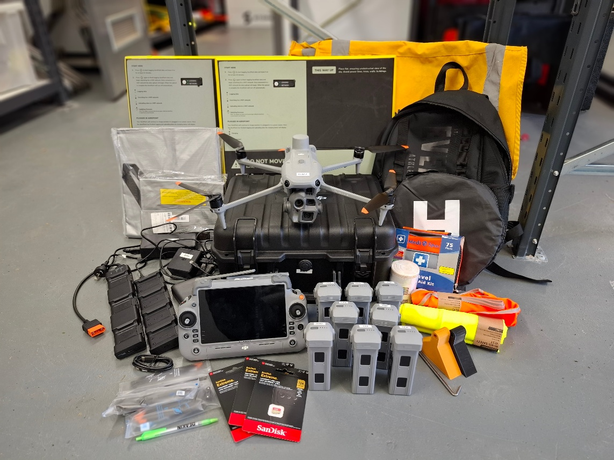*Drone Equipment*

- 1 x DJI Matrice 4 Enterprise with 3-year warranty

- 8 x DJI Matrice 4 Batteries\*

- 2 x battery chargers with charging boards and power supplies

- 1 x fireproof bag for charging batteries

- 1 x fireproof bag for battery transport

- 4 x pairs of spare propellers

- 4 x Micro SD Cards

- 1 x 20,000 mAh 100w battery bank

- 1 x Launch Mat

- 1 x First Aid Kit

- 1 x Airframe Manual

- 1 x Backpack

\* *Some groups may receive additional batteries.*

*RTK Options*

PropellerAero Option

- 2 x PropellerAero AeroPoints V2

- 2 x PropellerAero AeroPoint Chargers

- 1 x AeroPoint Bag

RTK GPS Option

- 1 x EMLID RS3 RTK GPS

- 1 x Survey Pole

- 1 x Tripod

- 1 x Carry Container

- 5 x GCP Markers

#  Mapping a New Site

Sites should be selected to maximise the amount of shoreline monitored
for the number of flights they can perform (nominally 6 flights). This
is typically a 3-5 km section of coast but will depend on the area of
fore-dune that needs to be captured. Six flights will usually take 3-4
hours on-site, depending on the accessibility of launch locations.

All selected sites must meet the Civil Aviation Safety Authority (CASA)
regulations for commercial operation in the Excluded Class. The NCDP
staff will assist in ensuring a site meets the regulations. If you are
not part of the NCDP, please note that official aviation charts are the
only authorised method of checking airspace, but apps such as opensky
(<https://wing.com/opensky>) are free apps which can assist in
understanding airspace and restrictions for drone operations.

A single flight should not exceed 800 m in length, and the airframe
should never exceed 400 m distance from the operator to maintain VLOS.
Operators are permitted to move (i.e. walk along a beach) while
operating a drone, but the drone must stay visible at all times (VLOS).

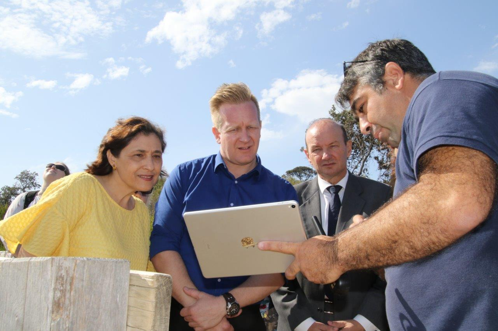Sites should be flown at low
tide to ensure as much of the beach as possible is captured in the
flight. In Victoria, there is a fortnightly tide cycle, so usually an
appropriate tide every 2 weeks. In the open coast we aim to map when the
tide is under 1m, and in Port Phillip Bay we aim to map when the tide is
under 0.5m. We normally map on the ebbing tide, through the low, and on
the rise. In general, we have at least 4 hours where we can map.

A Flight Authorisation Form and Risk Assessment (see Appendix) must be
completed for each site. Groups should also consider Public Liability
Insurance. Both are organised by the NCDP for groups within the program.

#  

# Before Mapping Commences

Prior to all drone operations, participants must understand drone
operation and safety procedures, both to minimise the risk of problems
developing, and so that participants know what actions are required if
an accident does occur. The NCDP Job Safety Assessment (JSA), Risk
Assessment, Airframe Checklist, Drone Operation Safety Briefing, and
other relevant documents can be found in the Appendix of this manual.

A pilot-in-command must be appointed for each mapping run. The
pilot-in-command is the fieldwork leader. It is their responsibility to
ensure all checks and safety documents are completed before each trip.
The pilot-in-command must also ensure all volunteers are signed-in and
briefed before operation. The pilot-in-command does not need to be the
person flying the drone, but they must be on-site on the day, and
appropriately trained.

It is essential that all members of the group collaborate and use the
same conventions for dates, times, weather conditions, site names,
flight numbers, etc. to ensure data continuity. A table of conventions
can be found in the Appendix of this manual. It is the
pilot-in-command’s responsibility to ensure all documents are completed
correctly before leaving the site.

The weather forecast should be checked within 48 hours of the mapping to
ensure the weather is conducive to safe drone operation. The following
weather forecast is required:

1)  The wind speed must be BELOW 15 knots (30 km/h) with gusts BELOW 20
    knots (37 km/h)

2)  Temperature must be BELOW 35 ⁰C (cold is fine, as long as it’s
    above - 10 ⁰C)

3)  Free from rain

4)  Free from low cloud/fog

5)  You cannot operate on a Total Fire Ban day, or a Catastrophic Fire
    Rating day.

Ensure that the following are charged (between 48 h and 24 h before
operation):

- 8 x DJI Matrice 4 E Batteries\*

- 1 x DJI Matrice 4 E controller

- 1 x 20,000 mAh 100w battery bank (can be used to charge the controller
  or a drone battery

- 2 x AeroPoints

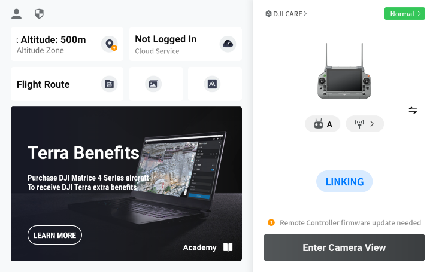Ensure that the data from
previous flights has been backed up and a confirmation receipt has been
received that all data has been received appropriately in the central
database before formatting the Micro SD cards using the controller.

Use the equipment list provided earlier to ensure you have all the
equipment required for the mapping operation.

Nominate a pilot-in-command responsible for the upcoming mapping.

Power on the DJI Matrice 4 E and controller ***with an internet
connection*** to check for updates. Some updates also require each
battery to be individually updated.

# Initial Drone Set-Up and Settings – DJI Matrice 4 Enterprise

Below are the general airframe settings. Once set, they are saved in
your drone, and do not need to be set each flight. Access these when the
airframe is powered-on, and clicking on “Enter Camera View” and then
clicking on the 3 dots at the top right of the screen
.

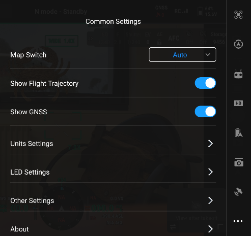Common
Settings :

In “Units Settings” we select to work in

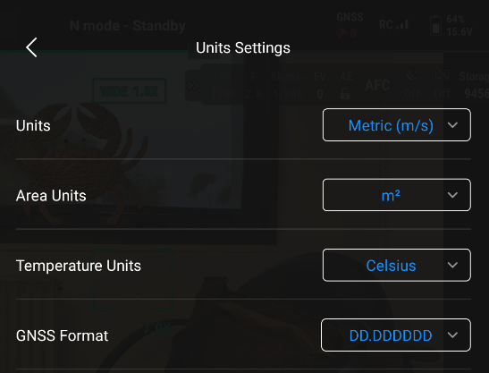 Units (Metric (m/s))

Area Units (m2)

Temperature (Celsius)

GNSS Format (DD.DDDDDD)

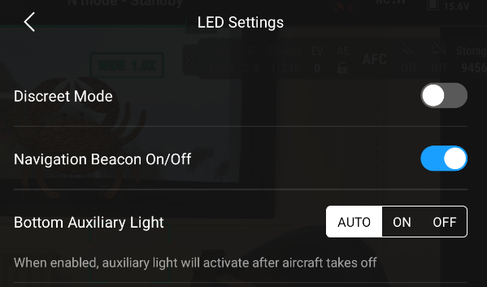

LED Settings (can be toggled in-flight):

Navigation Beacon On/Off – On

Bottom Auxiliary Light - On

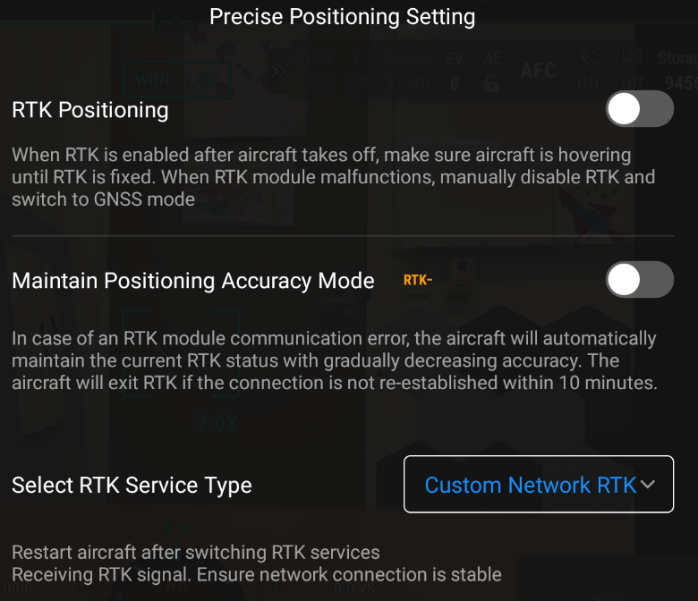Precise Positioning Setting
:

RTK Positioning – OFF

Maintain Position Accuracy Mode – OFF

> Select RTK Service Type – Custom Network RTK
>
> *Create a custom network (if within AusPOS network) – Example below
> for Victoria*

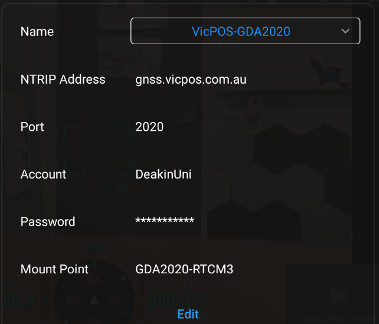

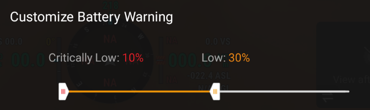Aircraft
Battery
:

Customize Battery Warning –

Low – 30%

Critically Low – 10%

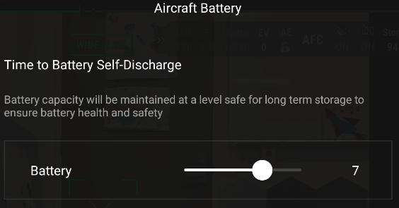***Note: We return when we
hit “Low 30%” and MUST land by 20%***

Time to Battery Self-Discharge:

We tend to use 7 days for this setting to allow for

Some variation in the flying day due to weather

Flight Settings
:

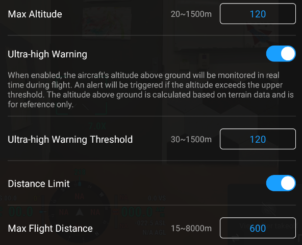Min Return to Home (RTH)
Altitude – we usually use 50 m but adjust to your location

Max Altitude: 120m

Ultra-high Warning Threshold: 120m

Max Flight Distance: 600 m

Sensor Status:

> Calibrate
> IMU and follow on-screen prompts PRECISELY.
>
> ***note: IMU Calibration is not affected by magnetism, etc. and can be
> undertaken inside***
>
> **Compass Calibration – done at the start of each day and cannot be
> done inside.**

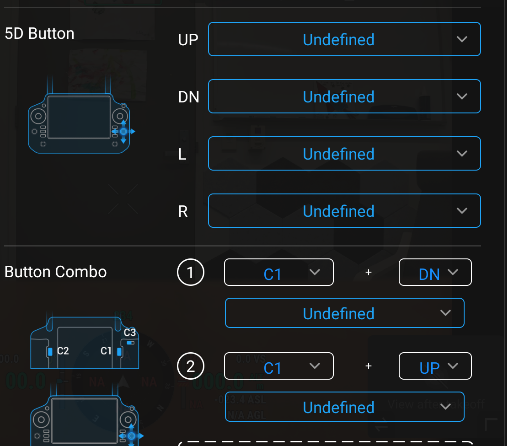Remote Controller Settings -
Customize RC Buttons
:

Set as many as possible to “undefined” so you don’t enable

something accidently while flying

Control Stick Mode – Mode 2

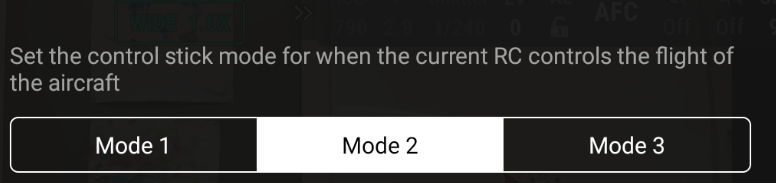

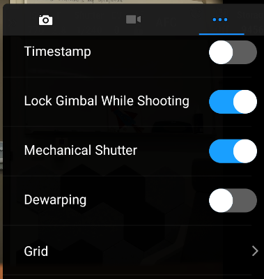Back on the main flying
screen, select the camera settings
,
and select the 3 dots 

Timestamp – OFF

Lock Gimbal While Shooting – ON

Mechanical Shutter – ON

Dewarping – OFF (recommended for mapping but not for taking promotional
images)

Format Memory Card – whenever you use a new SD card to ensure it’s

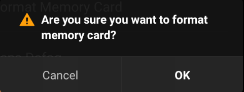in
the correct format

The “Preflight Check” window displayed before the Camera View or mission
should confirm these settings.

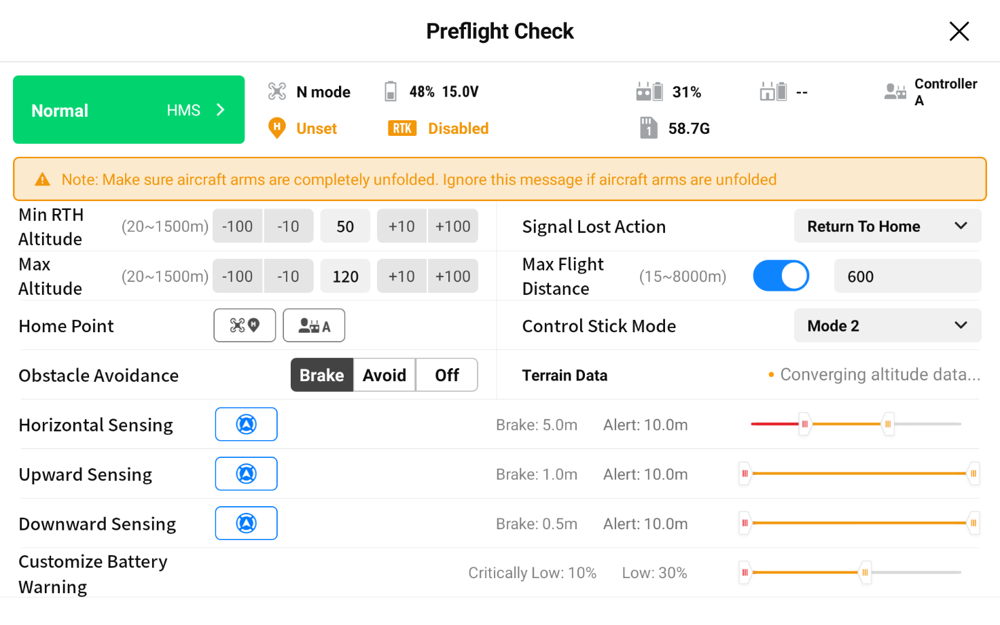  
**PLANNING A MISSION – DJI
Matrice 4 Enterprise**

We access and plan missions using the “Flight Route” option from the
main screen.

There are 3 types of missions we create as part of the NCDP: Grid,
Linear, and Oblique.

**Grid Mission** – This is the “standard” mission we undertake, and
produces the best data. It involves flying grid lines over the beach to
capture data at 100 m above the beach. However, there are times this is
not possible due to people on the beach and the requirement to maintain
30 m from people.

*Naming Convention:* M4E-SiteNameMissionNumberGRID ***e.g.
M4E-Frankston03GRID***

**Linear Mission –** Linear missions are undertaken at least 30 m
offshore and run parallel to the beach with the camera angled to look at
the beach. This allows us to complete mapping runs even if there are
people on the beach. These need to be conducted at 60 m AND 80 m to
achieve enough image overlap to make a 3D model. The data is not as
accurate as a grid mission, so please prioritise GRID missions when
possible, but the data from a Linear mission is accurate enough to be
worthwhile for measuring sediment movement.

*Naming Convention:* M4E-SiteNameMissionNumberLinHEIGHT ***e.g.
M4E-Frankston03Lin60***

**Oblique Mission –** This is like a Linear Mission, but it is run in
conjunction with a Grid Mission to capture vertically complex locations
like cliff faces and under hangs. It is not run at all sites, or even on
all missions at a site, only where it might add value. It is only run at
60 m, and does not need to be run in conjunction with linear missions as
they capture this data.

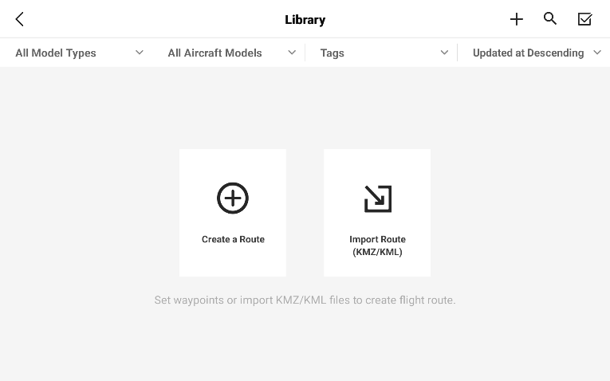*Naming Convention:*
M4E-SiteNameMissionNumberOBLIQUE ***e.g. M4E-Frankston03OBLIQUE***

For excluded class mapping missions, make sure the distance covered
allows the controller to retain a Visual Line of Sight (VLOS) at all
times. We recommend a maximum length of beach to map in a single run to
be **800m**, and only IF you intend to launch from the centre of the
area, ensuring the drone does not exceed approximately 400 m from the
pilot.

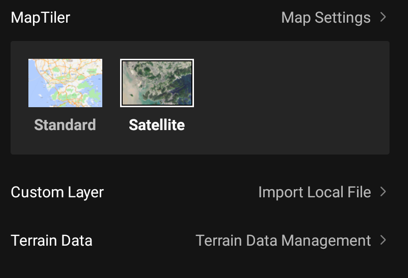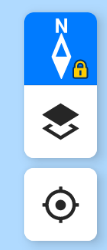The first step for creating
all missions is to click on the “+” in the top right corner of the
screen, and then select “Create a Route”.

Note: The button with 2 squares on the right side of the screen toggles
between the “standard” map and the “satellite” map. We find the
satellite map more useful.

## Grid Missions

Select “Create a Route” and then “Area Route”

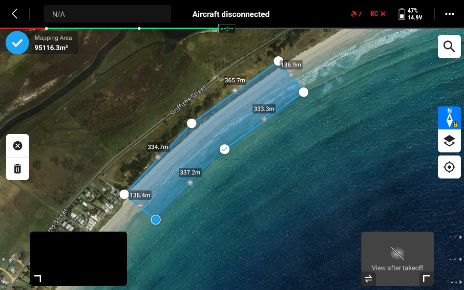Tap on the map to start
putting in your waypoints (points defining the area you want mapped).
For coastal monitoring missions, ensure that the area covers all the
public land to be captured as well as a section over the water. To
ensure you do not exceed 800 m, we recommend marking out a rectangle
which (will show you the length of each side on the screen) and then
adding additional points to have it conform to the beach or exclude
no-fly areas. In the example the longest side of the rectangle is 365.7
m + 334.7 m = 700.4 m. When complete, click on the blue tick in the top
left corner of the screen next to ‘Mapping Area’.

### 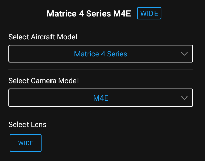‘Mapping Area’

On the right of the screen you can select the Aircraft Model and Camera
Model. The selection for the NCDP is:

Aircraft Model: Matrice 4 Series

Camera Model: M4E

Click “OK”

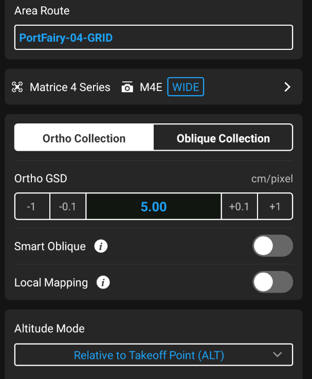***Note:*** If your aircraft
is powered-on this may be pre-selected for you.

### ‘Main Settings Screen – First Pass’

Area Route – Name the mission according to the conventions above

Ortho Collection

GSD – Ignore and set the Flying Height instead

Smart Oblique – OFF  
Local Mapping – OFF

Altitude Mode – Relative to Takeoff Point (ALT)

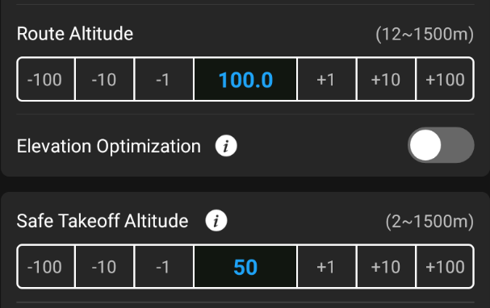Route Altitude – 100.0 m

> ***Note:*** This should change the Ortho GSD to 2.69 cm/pixel

Elevation Optimization - OFF

Safe Takeoff Altitude – 50 m (minimum recommended)

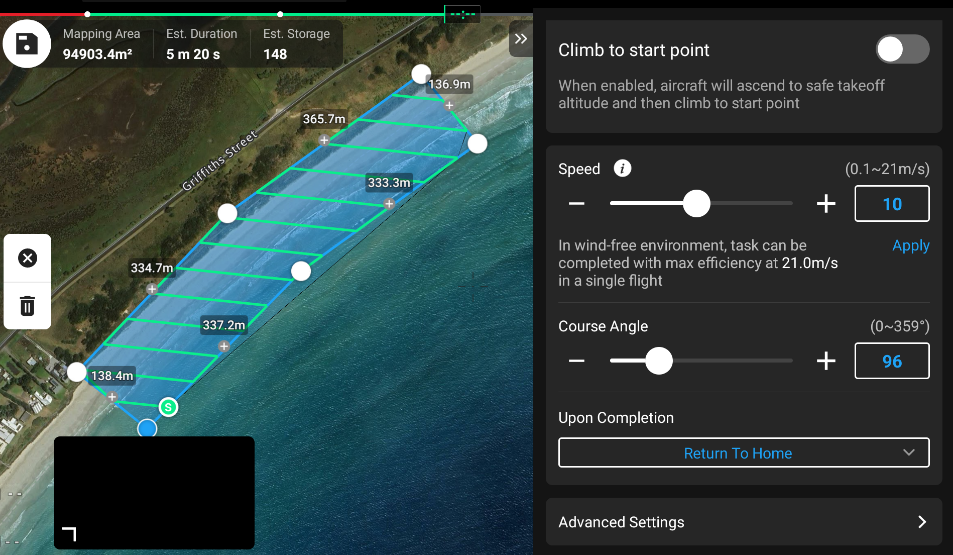Climb to start point –
OPTIONAL (more efficient if ON)

Speed – Ignore for now

Course Angle – adjust so the lines are similar to the image here, with
the lines angling in and out form the beach. DO NOT create long lines
along the beach as it is impossible to avoid people and will not achieve
the required overlaps.

Upon Completion – Return to Home

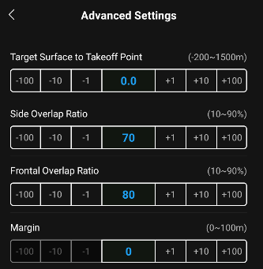

### ‘Advanced Settings’

Target Surface to Takeoff Point – 0.0

> ***Note:*** This can be used if you are flying from a cliff. If you
> are higher than the water, you set a *NEGATIVE* value. For instance,
> if you are launching form on top of a 30 m cliff and want the drone to
> be 100 m when over the water, you would set a -30 m Target Surface to
> Takeoff Point

Side Overlap Ratio – 70% (default, and works well)

Frontal Overlap Ratio – 80% (default, and works well)

> ***Note:*** Increasing the Side Overlap adds more lines to the mapping
> run, and increasing the Frontal Overlap increases the interval between
> photos, which can slow the drone down. Increasing either/both of these
> values increases the number of images taken for the area. When
> planning missions, it is a trade-off between adequate overlap and
> efficient use of images. We have experimented with values as low as
> 65% and 65%, but this will not work for all beaches. ***When
> processing in PropellerAero, 1 Credit is up to 957 DJI M4 E images.***

Margin – 0 (this is over-run on the mapping polygon and we do not want
the flight going outside it)

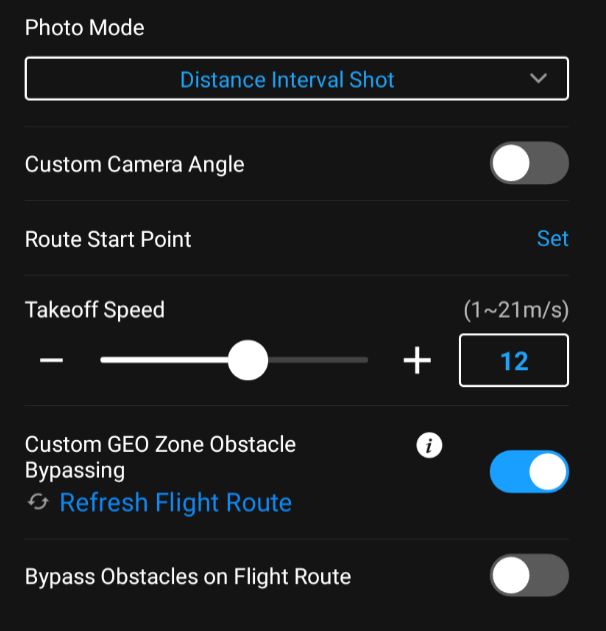Photo Mode – Distance
Interval Shot - This is more consistent than Timed Interval Shot

Custom Camera Angle – OFF

Route Start Point – Set (Default)

Takeoff Speed – up to 15 m/s is safe

Custom GEO Zone Obstacle Bypassing – ON (Default)

Bypass Obstacles on Flight Route - OFF (Default)

### ‘Main Settings Screen – Second Pass’

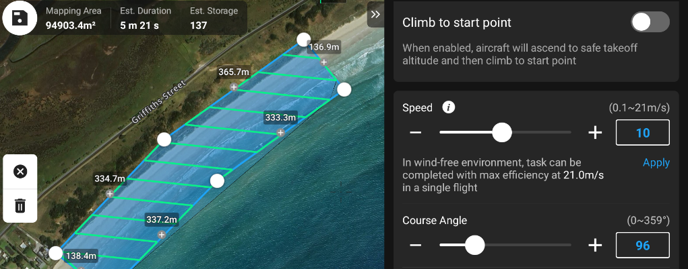Back on the Main Screen we
now adjust the final settings

Course Angle – make sure the course angle is “clean” without the
airframe doubling-back on itself, and flying as efficiently as possible.
If it isn’t adjust it.

Speed – The mission Est Duration needs to be **AT LEAST 5 MINUTES** to
allow for accurate RTK/PPK processing of the imagery. We recommend at
least 5 mins 15 sec for safety. Adjust the speed of the airframe to
achieve this for your area.

The final check is the number of images. As mentioned above, if this
data is using PropellerAero for processing, 1 credit is UP TO 957 DJI M4
E images, so ensure that all the missions combined will collect less
than 957 images (unless working to 2 credits, then the limit is 1914
images, and so on).

Save the settings in the top left corner 

If you need to edit the route at any point, expand the drop-down menu
next to the Mission name and select the edit pencil icon
. Don’t forget to save your
changes when you’re done.

## Linear Missions

Linear missions should be flown when undertaking mapping during busy
periods when keeping 30m away from public would be difficult. Your
linear missions should cover the same extent as the grid mission (if not
slightly larger each end to account for the time to get the camera in
position) but fly at least 30m from the beach in low tide conditions.

Linear missions must run both at 60m and 80m altitude with each mission
taking just under half of the total number of photos taken for the grid
equivalent.

It is recommended to create the GRID missions first and use their
coverage and number of images per flight to model your Linear Missions.

>  style="width:2.96806in;height:2.26528in" />***Note:*** These are
> easier to create accurately on the computer using GIS software, and
> then imported to the controller

### Linear Mission 01 – 60 m Flying Height

Select “Create a Route” and then “Waypoint Route”

Select the correct Model and Payload for your drone as above and click
OK

Waypoint Route – Name the mission according to the conventions above for
Linear Missions

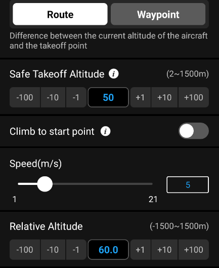Draw your linear mission to
cover the extent of the grid equivalent. Each tap will add a waypoint.
The mission should be AT LEAST 30 m offshore at the lowest tide, the
lines should traverse the length of the beach covering the same area as
the grid mission, move further out to sea by 20-30 m, and then traverse
parallel to the initial line back to the start (see image). The screen
does not provide route lengths or distances, so using the Grid mission
as a template in GIS software and using measurements and buffers is the
most accurate method of creating linear missions.

#### “Route” Tab – First Pass

Safe Takeoff Altitude - 50 m (minimum recommended)

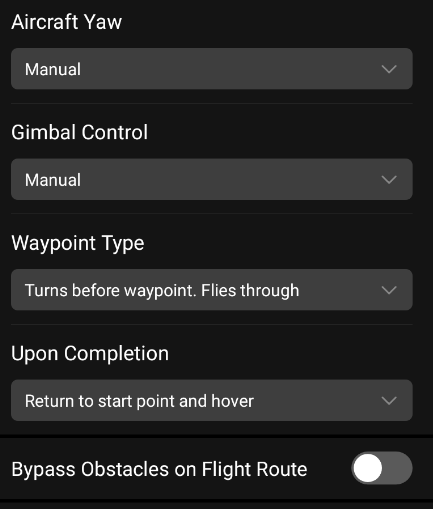Climb to start point –
OPTIONAL (more efficient if ON)

Speed – Ignore for now

Relative Altitude – 60.0 m

Aircraft Yaw – Manual

Gimbal Control – Manual

Waypoint Type – Turns before

waypoint, Flies through

Upon Completion – Return to start

point and hover

Bypass Obstacles on Flight Route – OFF

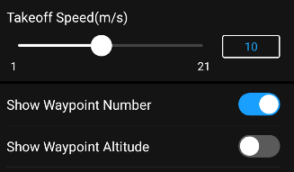

Takeoff Speed – up to 15 m/s is safe

Show Waypoint Number – ON (Default)

Show Waypoint Altitude – OFF (Default, optional)

#### “Waypoint” Tab

Any settings undertaken on a waypoint continue until another command is
given, so we will conduct all settings on the “S” waypoint (starting
waypoint), and they will be carried though for the whole mission.

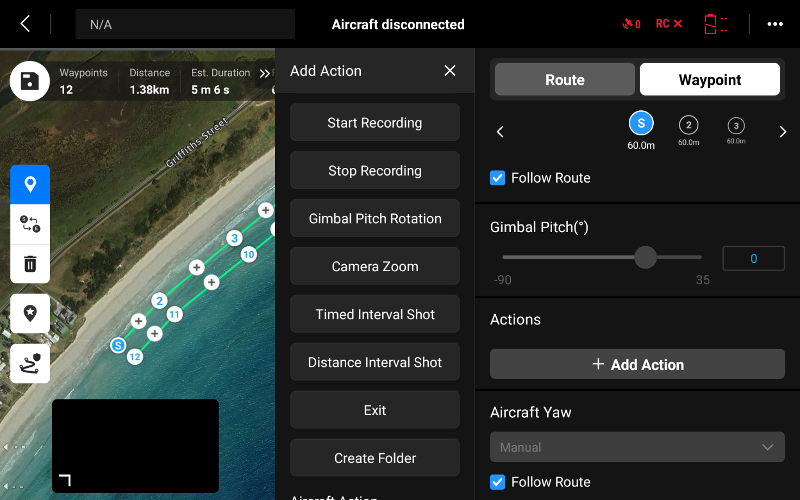Select the “S” Waypoint

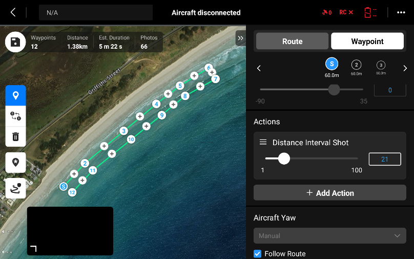Leave most of the settings,
but scroll down to “Actions” and “Add Action”. Select “Distance Interval
Shot”

Adjust the distance between images until the total number of images for
the mission is just under half the grid mission. For example, the GRID
mission in the example above was 137 images. Half of these images is
68.5. Round down slightly to 65 images, and adjust the Distance until
the number of photos is 65. In this case, a “Distance Interval Shot” of
21 m equals 66 photos.

> ***Note:*** Sometimes the “Photos” don’t update after changing the
> distance value in “Distance Interval Shot”, but if you toggle back to
> “Route” and change the speed, both the “Est. Duration” and “Photos”
> will update.

#### “Route” Tab – Second Pass

Speed – The mission Est Duration needs to be **AT LEAST 5 MINUTES** to
allow for accurate RTK/PPK processing of the imagery. We recommend at
least 5 mins 15 sec for safety. Adjust the speed of the airframe to
achieve this for your area.

Save the settings in the top left corner 

If you need to edit the route at any point, expand the drop-down menu
next to the Mission name and select the edit pencil icon
. Don’t forget to save your
changes when you’re done.

### Linear Mission 02 – 80 m Flying Height 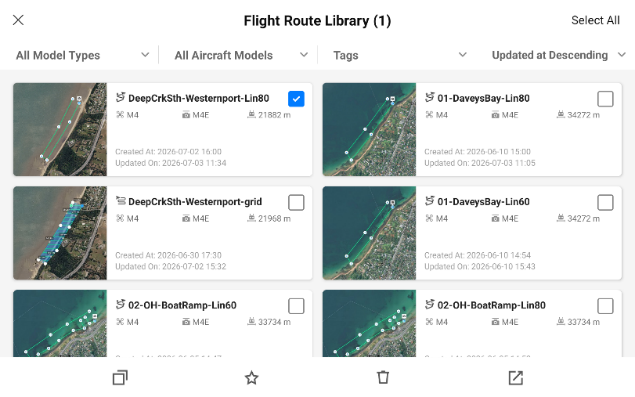

To create an identical linear mission at 80 m altitude, touch and hold
the 60 m Linear mission you just created, then tick the square in the
top right of the mission and ‘Copy the selected task’ by tapping the
copy
icon
in the bottom left corner of the screen. This duplicates the mission.

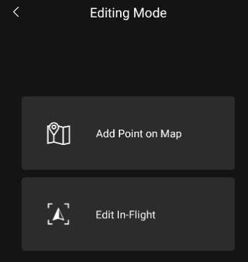Open the copy of the linear
mission, edit the route by expanding the drop-down menu next to the
Mission name and select the edit pencil icon
. Then ‘Add Point on Map’

Edit the name of the mission to real Lin80

In Route tab, change the Relative Altitude to 80 m and change the Upon
Completion to ‘Return to Home’

Save the mission in the top right corner 

## Oblique Missions

Oblique Missions run in conjunction with a Grid Mission to capture
vertically complex locations like cliff faces and under hangs. It is not
run at all sites, or even on all missions at a site, only where it might
add value. It is only run at 60 m, and does not need to be run in
conjunction with linear missions as they capture this data. Better
quality data is achieved by flying a GRID and OBLIQUE mission than
Linear missions.

Select “Create a Route” and then “Waypoint Route”

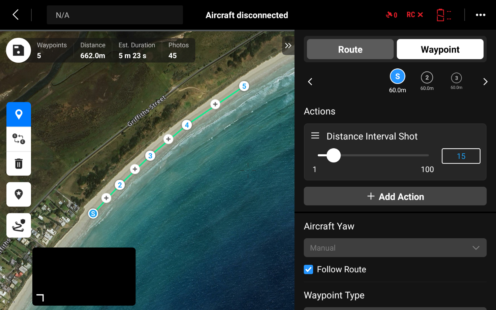Select the correct Model and
Payload for your drone as above and click OK

Waypoint Route – Name the mission according to the conventions above for
Oblique Missions

Draw a line to cover the extent of the area you want to capture oblique
imagery. It can match the length of the GRID mission, or be a subset of
the mission, depending on the size of the vertically complex area. Each
tap will add a waypoint. The line DOES NOT need to be 30 m offshore, and
does not double back (see image).

### “Route” Tab – First Pass

Safe Takeoff Altitude - 50 m (minimum recommended)

Climb to start point – OPTIONAL (more efficient if ON)

Speed – Ignore for now

Relative Altitude – 60.0 m

Aircraft Yaw – Manual

Gimbal Control – Manual

Waypoint Type – Turns before

waypoint, Flies through

Upon Completion – Return to Home

Bypass Obstacles on Flight Route –

OFF

Takeoff Speed – up to 15 m/s is safe Show Waypoint

Number – ON (Default)

Show Waypoint Altitude – OFF (Default, optional)

### “Waypoint” Tab

Any settings undertaken on a
waypoint continue until another command is given, so we will conduct all
settings on the “S” waypoint (starting waypoint), and they will be
carried though for the whole mission.

Select the “S” Waypoint

Leave most of the settings, but scroll down to “Actions” and “Add
Action”. Select “Distance Interval Shot”

Adjust the distance between images to achieve the images you want. We
recommend at least 30 images to cover 700 m in length. In this example,
a “Distance Interval Shot” of 15 m will collect 45 photos.

### 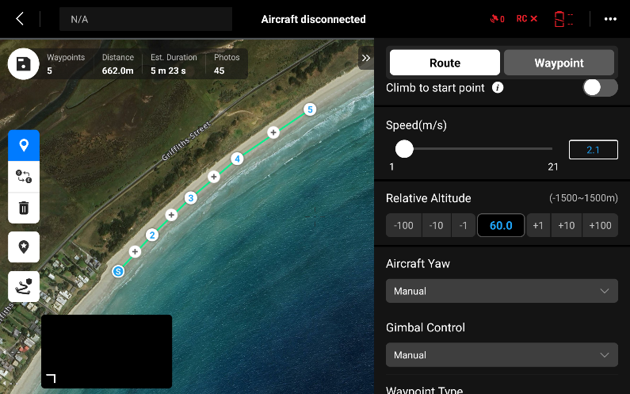“Route” Tab – Second Pass

Speed – The mission Est Duration needs to be **AT LEAST 5 MINUTES** to
allow for accurate RTK/PPK processing of the imagery. We recommend at
least 5 mins 15 sec for safety. Adjust the speed of the airframe to
achieve this for your area. In this example, the speed is set to 2.1 m/s
to achieve at least 5 mins in the air.

Save the settings in the top left corner 

If you need to edit the route at any point, expand the drop-down menu
next to the Mission name and select the edit pencil icon
. Don’t forget to save you
changes when you’re done.

## Importing a Flight Route

You can create a polygon or a polyline (note that waypoint missions are
imported as polylines NOT points) you have created on your computer
using GIS software (e.g. QGIS, ArcGIS or Google Earth). Make sure to
export them as KML or KMz files. Google Earth files are the easiest
format to import into the controller. These missions can then be copied
into your controller via a MicroSD card. Create the missions, save them
on a MicroSD card, insert a MicroSD card into the bottom of the
controller (next to the charging port).

1.  In the Flight Route Screen, select ‘+’ in the top right corner and
    ‘Import Route (KMZ/KML)’

Find your .kml file on the Memory card, tick the box on the right hand
side next to the file and tap Confirm in the top right corner, then
select ‘Area Route’ if importing a grid mission (polygon) or ‘Waypoint
Route’ if creating a Liner mission (polyline).

Open the imported mission, edit the route by expanding the drop-down
menu next to the Mission name and select the edit pencil icon
.

Re-name the mission appropriately (if the initial file was not named
appropriately), and follow all steps as you would when creating a new
mission. Don’t forget to hit save when you’re done.

# Conducting Mapping

## Step 01 – Arrival to Site

On arrival to site, the pilot-in-command should ensure the weather
conditions match the forecast, and meet the requirements for drone
operation. Visually inspect the site, checking for tide height, and the
ability to maintain 30 m from the public. Where necessary ensure that
spotters and cones/ signage/ tape are used to maintain minimum
distances. Check all equipment against the provided equipment list and
ensure everything is operational.

The pilot-in-command must perform the drone Operation Safety Briefing
for any new participants (see Appendix) and ensure all participants are
aware of their roles. The pilot-in-command must also ensure that a
Flight Authorisation Form and Risk Assessment have been completed for
the site, and they have been read and understood by all participants.

## Step 02 – Setting Out the AeroPoints

The PropellerAero AeroPoints are Ground Control Points (GCPs) with an
inbuilt high-precision GPS. The GCPs allow the data captured to be
registered horizontally and vertically that will allow precise
comparison over time. We use 2 AeroPoints during our mapping.

There are 2 methods to set out AeroPoints. The first method (called the
“Global AeroPoint” method) is preferred, but involves leaving one
AeroPoint unattended for the duration of the mapping. Busy sites may not
have an appropriate location where an AeroPoint can be safely left
without being disturbed, so the alternate is the “Roving AeroPoints”
method. The “Roving AeroPoint” method is described in Step 3.

***“Global AeroPoint
Method”***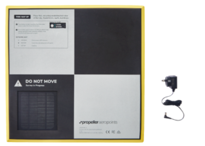

Place one AeroPoint approximately in the middle of the entire mapping
area. Place it on even ground in a location open to the sky. Peg it down
to stop it being disturbed, and place a sign next to it. Press the
button on the AeroPoint & ensure there is a solid light on “logging”.
Watch it for 5 seconds to ensure it stays on “logging”. This AeroPoint
stays logging for the duration of the mapping. It becomes a “mini base”
and increases the accuracy of the AeroPoint used at each launch point,
and works as a redundancy in case the AeroPoint at the launch location
fails.

*Step 03 – Arrival at Mapping Run*

Head to your mapping run. Mapping runs should be undertaken
sequentially, starting at one extent of the area and progressing through
the missions to the other end. This assists with light and tide
consistency when stitching the missions together in the photogrammetry
software. It does not matter which end you start. You can refer to your
“Site Plan” for specific notes about the site, including whether to use
the “Global AeroPoint” or “Roving AeroPoints” method (and where to place
the Global AeroPoint), the number of flights to undertake, the parking
location and recommended launch location for each mission, the local
land manager, and any relevant information about the mapping site or
each individual flight.

Once you arrive in approximately the centre of the mapping area, set up
your AeroPoint. The AeroPoint should be placed on even ground in a
location open to the sky approximately 10 m from your launch location,
so you don’t shadow the GPS receiver. Avoid placing AeroPoints beneath
trees or power lines and avoid putting them directly next to walls or
buildings. Press the button on the AeroPoint and ensure there is a solid
light on “Logging”. If the Light is flashing “Network”, press it again,
and it should go to “Logging”. Once the light is solid on “Logging”,
watch is for approximately 5 seconds to ensure it does not change.

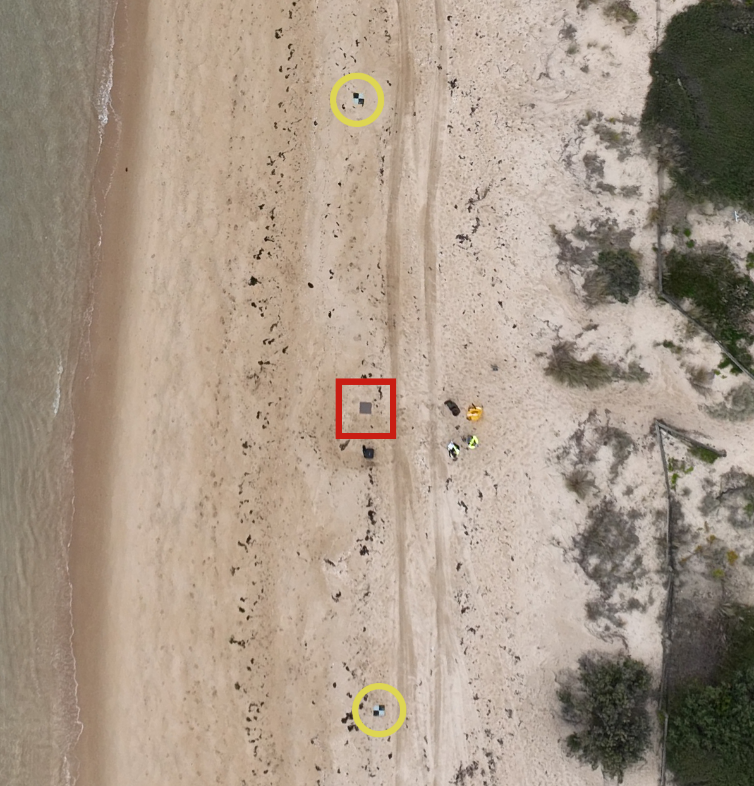The
AeroPoints **<u>must be logging for at least 10 minutes.</u>** If the
AeroPoint is moved during the mapping, it will not record accurately.
The Global AeroPoint is a back-up if this AeroPoint gets moved or does
not record properly.

***“Roving AeroPoints Method”*** – This is used when there is not a
suitable location to leave an AeroPoint unattended. Set out the second
AeroPoint approximately 10 m on the other side of the launch point (at
least 20 m from the first AeroPoint). As above, Press the button on the
AeroPoint and ensure there is a solid light on “logging”. Watch the
light for approximately 5 seconds to ensure it does not change. The
AeroPoints must be logging for at least 10 minutes. If the AeroPoint is
moved during the mapping, it will not record accurately. The Roving
AeroPoint is a back-up if the other AeroPoint is moved or does not
record properly. You can peg these AeroPoints down if you are concerned
they may get knocked, but the sign is not necessary as you are there to
answer any questions.

> **NOTE:** If you place an AeroPoint incorrectly after you have pressed
> the button, that’s fine. Simply press the button again to stop the
> recording, reposition it, and press the button again to start
> recording in the new location.
>
> If you notice the AeroPoint light is not solid on “logging” when you
> go to pick it up, check the second AeroPoint OR turn the AeroPoint on
> and re-fly the mission. The AeroPoints are critical to achieving high
> accuracy data.

## Step 04 – Setting Up the drone

Check the Damage and Maintenance Log (see Appendix) to ensure there are
no outstanding unserviceabilities to your airframe. The second person in
the drone team should ensure all paperwork and checklists are completed.

Set out the Launch Pad. When possible, have a 10 m x 10 m open space
around your airframe. The minimum requirement is 5 m x 5 m.

Complete the Assembly and Pre-Flight Inspection sections of the Airframe
Checklist and sign the Time in Service Log (see Appendix). The second
person in the drone team should ensure these are completed.

## Step 05 – Operating the drone

Fill in the Pre-Flight section of the Daily Sheet (see Appendix). The
second person in the drone team should ensure these are completed.

Follow the Start-Up section of the Airframe Checklist (see Appendix).
When possible, ensure you are running a Wi-Fi Hotspot from a mobile
phone, and the controller is connected to the Wi-Fi.

Hotspot Name: Propeller

Password: propeller

If the controller says you are “logged-out” or prompts you to “sign-in”,
the email address and password can be found on the back of the
controller. They are:

Username: <ncdp@deakin.edu.au>

Password: 1234yolla

Please note that you will need to be connected to the internet to
“sign-in”. The information for the Hotspot is above.

If it is the first flight of the day, or if you have travelled more than
20 km from your previous flight, conduct a COMPASS CALIBRATION (see
Checklist for instructions). Also ensure that the SD card has enough
capacity for the number of images you will be collecting in this
location.

Load your mission by selecting “Flight Route” and select the relevant
mission (there is a search bar at the top right of the screen)

Ensure the airframe icon matches your location on the screen, and is in
approximately the middle of the mapping area. click on “Play”, symbol
next to the mission’s name. A “settings” screen will appear. Check the
settings are correct, swipe to the bottom, and press “next”.

**Note:** If you swipe too hard to the bottom of the screen, you might
accidently swipe out of the app. Don’t worry, just click on the “DJI
Pilot 2” app on the screen, and it will take you back to where you were.

A second screen of settings will appear, check these settings, then
click “Upload Flight Mission”. You now have the option to click “Start”.
Once you click “Start” the motors will start and the drone will launch,
so please do one final check that you are save to launch before
pressing. The airframe will take off and climb to the predetermined
height, and then head to the start of the autonomous mission. Ensure you
can maintain 30 m from the public before launch.

If you are conducting a Linear Mission due to a busy beach, or you are
concerned about the direct line the drone will take to the start point,
you can manually launch the drone and fly it to a safe
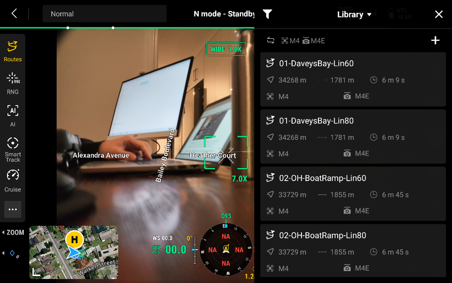location before loading and
starting the mission. Click on “Enter Camera View”, and check the
settings before pressing “Next”. Check you have a GPS connection and
that you’re in “N” mode. Start the motors by bringing both sticks into
the centre of the controller and then down. Launch the drone and fly out
over the water, at least 30 m offshore and 50 m up. Click on “Routes”
and find the appropriate mission. Ensure the airframe icon matches your
location on the screen, and is in mapping area, and then press “Play”.

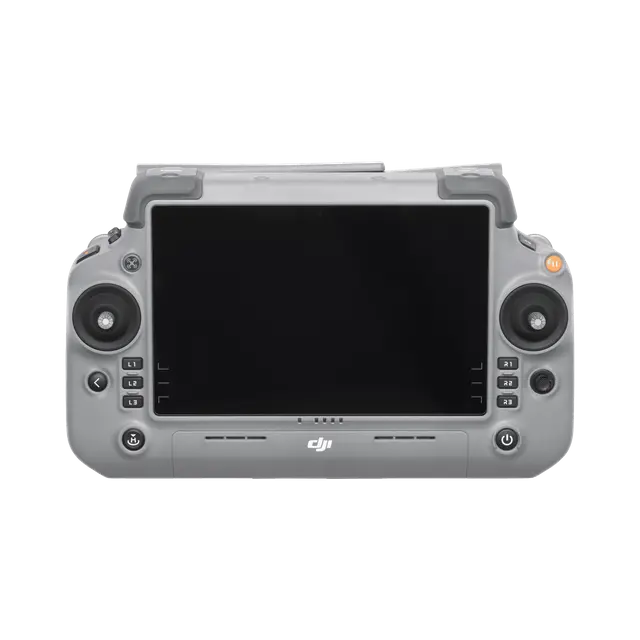During the
operation, ensure you can always maintain Visual Line of Sight (VLOS) of
your airframe. This will be facilitated by starting a mapping operation
approximately central to each segment. Alternate between watching the
airframe, screen, and the area for the public. The second person in the
drone team should assist with monitoring all three. You can pause the
autonomous flight by pressing “PAUSE” button on the controller, or on
the screen. Once paused, you can hover in place, move the drone off the
mission, or descend to avoid an aircraft. To resume a paused mission,
press “CONTINUE” on the screen. The airframe will resume it’s autonomous
flight from the “breakpoint” which is the point in the mission you hit
pause. If you need to cancel the autonomous mission, the easiest method
is to hit the pause button, and then either press the “Return to Home”
button, or manually fly the drone back.

Once the autonomous mission is complete, the transmitter will beep
continuously to indicate the drone is returning to land. Sometimes, the
drone will hover 1-2 m above the ground and not land. This means it’s
detected an obstacle. If you look at the screen there will be an option
to “Force Land”. If there isn’t an impeding obstacle, select “Force
Land”. If there is an obstacle, take manual control, move to a safe
location and manually land.

If returning and descending manually, ensure you descend on a minimum of
a 45° angle. Once you are 1 m from the ground, hover over the landing
site and descend straight down slowly. When the airframe touches the
ground, move the throttle stick all the way to the bottom and hold until
the motors stop spinning.

Once the airframe has landed, follow the Disarm / Post-Flight Inspection
/ Disassembly Checklist and fill in the Post-Flight section of the Daily
Sheet (see Appendix). The second person in the team should ensure these
are completed. You do not need to pack-down the drone if you are doing
additional flights and have a safe method to transport the drone.

Check to ensure the AeroPoints were not moved during the flight. If only
one AeroPoint was moved, make a note of the AeroPoint ID location so
that the point can be identified and removed when submitting the data
for processing. If both AeroPoints were moved, or did not record, you
must re-fly the section with the AeroPoints working. Assuming the light
is still solid on “Logging”, press the button on each AeroPoint to
finish recording BEFORE you pick them up. When you press the button, the
light should change to flashing “Network”. If your Hotspot is active,
(Propeller), the light might go solid on “Network”. This is the
AeroPoint uploading it’s data to the portal. You do not need to upload
the data from the AeroPoint after each placement. AeroPoints can store
data from at least 100 points before requiring upload, so don’t worry
about them filling up.

If you are completing multiple flights in the same site, move to the
next launch site and repeat Steps 03 - 05 of this manual.

### Additional Information for Linear and Oblique Missions

When conducting Linear or Oblique “Waypoint” missions, the drone can fly
along the path and trigger the camera, but it cannot autonomously
orientate and angle the camera at the beach. In these scenarios, the
pilot must orient the drone and angle the camera to look at the beach.
This can only be done once the first photo is taken, and if the drone is
paused, it will often re-set the camera to the starting position. As
such, the pilot must wait until the mission starts, then yaw the drone
(left stick) so that the camera faces the beach, and use the camera
pitch wheel (left wheel on the controller) to correctly orient the
camera. The drone will hold the orientation and angle you input.

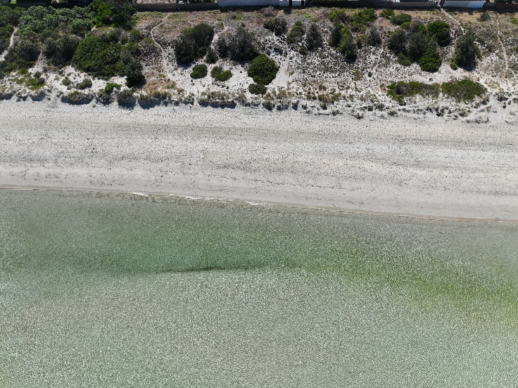*<u>Linear Mission</u>*

When running a Linear mission, the objective when orienting the drone is
to be parallel to the beach. For camera angle, the beach itself should
be in the middle of the frame. However, you must also ensure that you
are not catching the horizon in the images. On the right is an example
of a well-oriented and angled linear image. Both the beach the dune, and
the water line are clearly visible, but the houses have been excluded,
and the horizon cannot be seen in the image. This angle is the objective
of a Linear Mission.

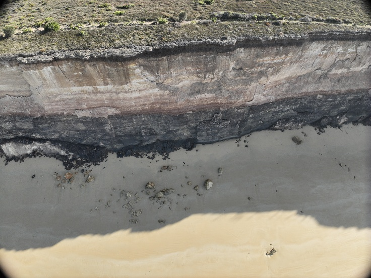*<u>Oblique Mission</u>*

When running an Oblique mission, the objective when orienting the drone
is to be parallel to the vertical surface with most of the image focused
on the vertical surface. Capturing the beach and water line is not the
priority as it is captured by the Grid mission. Importantly, the horizon
cannot be seen in the image. This angle is the objective of an Oblique
Mission.

## Step 06 – Packing Down the drone

Once flying is complete for the day, add up the flight time on the Daily
Sheet, and add the time to the Time in Service Log, and sign both.
Record any damage in the Damage and Maintenance Log (see Appendix). The
second person in the drone team should ensure these are completed.
Ensure the drone and the box are clean of sand and salt when packing-up.

## Step 07 – End of Mapping

***“Global AeroPoint Method”*** – Once all the mapping is complete,
return to the Global AeroPoint and press the button to finish recording
BEFORE you pick it up.

AeroPoints are built tough, but you can extend their life by keeping
them clean and dry when not in use. Simply remove dirt and dust with a
damp cloth as soon as practicable once your job is complete. Like a
phone or a watch, AeroPoints are water-resistant (they can handle some
mud, splashes, or light rain) but not waterproof (they shouldn’t be
submerged or left out in heavy rain). Reduce the risk of sand or gravel
scratching the solar panels by stacking and storing AeroPoints with the
undersides together. Be careful to ensure that AeroPoints are away from
the low water mark and will not be impacted by a rising tide or wave
action.

Once complete, the pilot-in-command should ensure all participants are
accounted for, have signed-out, and all documentation has been
completed. Ensure that BOTH have been collected, and were correctly
switched off. Make sure all drone equipment is accounted for, clean of
sand, and packed away. Ensure all Micro SD cards are accounted for.

> ***Note:*** If the site is difficult to access or re-visit, we
> recommend checking the data capture was successful by ensuring all
> images are on the SD card. This can be done on some phones via a USB-C
> SD Card Reader (works on Android phones) or via a computer.

# Data Upload

Both the images off the Micro SD cards and data from the AeroPoints need
to be uploaded via an internet connection. Below is the methodology for
uploading data to the internet:

## Imagery Upload

Survey data is uploaded through the NCDP intake portal at
**[ncdp.auscope.org.au](https://ncdp.auscope.org.au)**. The portal accepts the
imagery, the processing outputs and the metadata in one submission, runs an
automated quality check, and passes everything to the national archive at NCI.
You do not need to zip anything, and you do not need a separate metadata form.

### Before you start

Have these ready on the computer you are uploading from:

- **The processing report** (PDF) from Propeller, Pix4D or Agisoft
- **The products** — orthomosaic, DSM and point cloud
- **The raw imagery** — every image from the Micro SD card, for every flight
  at the site

If you do not have a Micro SD card reader, we can provide one.

Uploads resume if your connection drops, so a large raw imagery set does not
have to complete in one sitting. Leave the browser tab open while it uploads.

### First time only: register

Go to ncdp.auscope.org.au and select **Register**. You will be asked for your
name, email, organisation and state, and — if you have one — the drone you fly:
its model, type, serial number and sensor angle.

Recording the drone at registration is worth the extra minute. It is stored
against your organisation, and from then on it fills itself in on every survey
you submit. If your organisation flies several aircraft, each one can be
registered and you choose which you flew from a list.

Registration does not grant access on its own. The NCDP team approves new
contributors, and you will receive a sign-in link by email once approved.

### Uploading a survey

1. **Sign in** at ncdp.auscope.org.au and select **Contribute**.

2. **Upload the processing report first.** The portal reads it and pre-fills
   what it can — acquisition date, coordinate system, site name, and the
   accuracy figures. Everything it fills stays editable.

3. **Check the metadata.** Fields you have submitted before are already filled
   in from your last survey — your organisation, licence, purpose, region,
   aircraft and processing details. Change anything that is different this
   time; leave the rest.

   Select the aircraft you flew from the **Airframe** list. Its model, type and
   sensor angle fill in below. If you flew something borrowed or unregistered,
   type over them.

   Five fields must be filled before a submission can go through: site name,
   acquisition date, region, point of contact and access level. Everything else
   improves the record but will not stop you.

   Where you genuinely do not know a value, select **Unknown** rather than
   guessing or leaving it blank. "Unknown" is a real answer and is recorded as
   one; a guess is not.

4. **Upload the products and the raw imagery** into their buckets. Select every
   image for the site, across all flights — the portal compares the count
   against the number in your processing report and flags a mismatch, which is
   usually the first sign that a card was missed.

5. **Submit.** The automated checks run, and you will see the result on screen
   and by email.

### What the checks mean

Most checks warn rather than block. A warning does not stop your survey being
archived; it flags something for the NCDP team to look at.

Two things will stop a submission: missing critical metadata (site, date,
region, contact, access level) and anything that looks like an executable file
in the upload. Everything else flows through with a note attached.

You may see a warning that the site and date are **already in the archive**.
If you are re-uploading a corrected version of a survey, that is expected —
the new version supersedes the old one and both are kept. If you were not
expecting it, check the acquisition date before continuing.

### After you submit

Your survey is scanned for malware, moved to the NCI archive, restructured
into the standard directory layout, and reprojected to GDA2020. Products and
previews then appear in the public catalogue at ncdp.auscope.org.au. None of
this needs anything further from you, and you do not have to wait for it.

File and directory naming, the processing levels and the full metadata schema
are published at
[github.com/NCDP-Australia/ncdp-standards](https://github.com/NCDP-Australia/ncdp-standards).
You do not need to rename anything yourself — the portal does it.

## AeroPoint Upload

the easiest method of uploading AeroPoint data is by using a phone’s
‘Hotspot’ connection. To connect to the PropellerAero AeroPoints, call
the Hotspot Wi-Fi network ‘Propeller’ with the password ‘propeller’.

If AeroPoints find a Wi-Fi network named ‘Propeller’ within 24 hours or
recording data, they’ll enter ‘upload mode’ whereby they automatically
connect to the network and upload recorded data. This mode is indicated
by a slow blink on the green light on “Network” (looking for Hotspot)
followed by a solid green light on “Network” (uploading). If more than
24 hours have passed since AeroPoints finished recording, you’ll need to
wake them up from ‘sleep mode’ (light off) to upload data. To do this,
simply press the button. If the “Logging” light comes on, press it again
and it will go to “Network”. When upload is complete, the AeroPoint
lights will turn off (sleep mode).

- Using an Android device

  - The procedure for setting up a Wi-Fi hotspot is different for each
    Android device. Refer to instructions from your specific device
    manufacturer (or Google it!)

<!-- -->

- Using
  an iOS device

  - Change your device name From Settings, navigate to General\> About\>
    Name. Change the name of your device to ‘Propeller’.

  - Change your Personal Hotspot password From Settings, navigate to
    Personal Hotspot. Change Wi-Fi password to ‘propeller’ and toggle
    Personal Hotspot to ‘on’ (green).

  - iOS devices allow only five concurrent connections to your Personal
    Hotspot. We recommend uploading your data five AeroPoints at a time.

  - Important: Keep your iOS device open on the Personal Hotspot screen
    to maintain connection and monitor data upload.

## AeroPoint Charging

AeroPoints come with a charger, but when you plug them into the power,
the lights do not come on to indicate charging. To rectify this you must
connect them briefly to a Hotspot. Turn on the “Propeller” Hotspot and
press the button on the AeroPoint. If the “Logging” light comes on,
press it again and it will go to “Network”. Once the AeroPoint has
connected to the Network, both lights will start flashing to indicate
“Charging”. Once fully charged, both lights will stay on solid. We are
hopeful there will be an update which enables the lights when charging
without connecting to the network, but for now we must use this method.

#  Additional Data Capture Techniques

*Mapping Over Water*

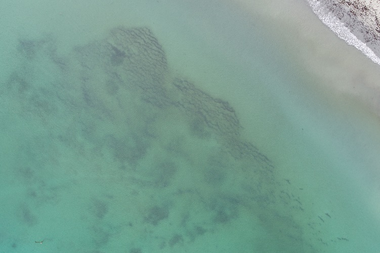
Water is constantly moving, uniform in colour, and the line of breaking
waves moves between images. These factors result in data processing
software struggling to tie images of water into the maps. Therefore, we
try to limit the amount of mapping we undertake over water. The
exception to this rule is very still/ clear water, and shallow water
with reef or distinguishable seabeds. In these cases, stitching images
over water can be possible. However, some tie-points will be for
structures below the water, while others will be on the surface. This
leads to errors in the 3D model over water. While photogrammetry
software will build the 3D model of either the water surface or an
approximation of the topography under the surface, it will not be
vertically accurate, and should not be used in the same manner as the
beach vertical surfaces. The 3D model for the tideline in all maps also
tends to have errors due to the moving waves, and is edited by people
who process the data.

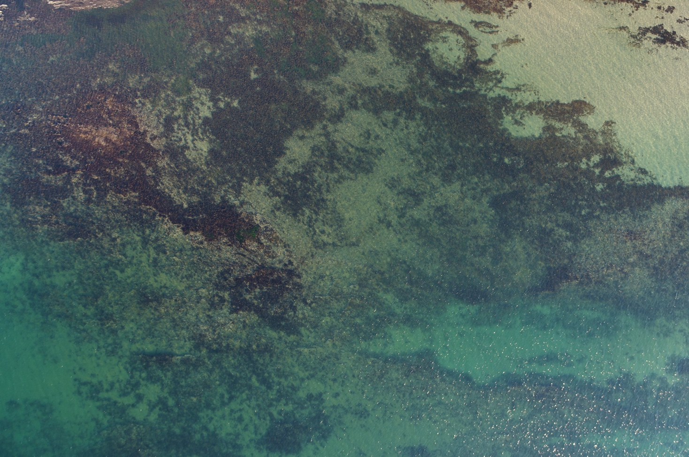

# Accident or Incident Reporting

If you have an accident or incident operating a drone, there are several
groups which must be informed.

1)  Firstly, please telephone any emergency services (ambulance or fire
    brigade) if necessary

2)  Next, please telephone your regional contact. They will inform you
    how to proceed in the event of an accident or incident which may be:

- a Routinely Reportable Matter (RRM) - meaning that there has been an
  incident in which no one is injured and the only damage is to the
  drone, or

- an Immediately Reportable Matter (IRM) - meaning that there has been
  injury to the public or damage to someone’s property

3)  Please be aware that any accident or incident involving a drone MUST
    be reported to the Australian Transport Safety Bureau (ATSB). If an
    operation results in an immediately or routinely reportable matter
    the pilot-in-command must take reasonable steps to preserve any
    flight planning and operational data, and drone components which may
    assist in validating the cause of the incident.

<table>
<colgroup>
<col style="width: 50%" />
<col style="width: 50%" />
</colgroup>
<thead>
<tr class="header">
<th><strong>Immediately Reportable Matters</strong></th>
<th><strong>Routinely Reportable Matters</strong></th>
</tr>
</thead>
<tbody>
<tr class="odd">
<td><ul>
<li>
Make a report as soon as is reasonably practicable by telephone
on 1800 011 034
</li>
<li>
Follow up with a written report within 72 hours
</li>
</ul></td>
<td><ul>
<li>
Submit a written report within 72 hours
</li>
</ul></td>
</tr>
</tbody>
</table>

*Information to provide when notifying local management*

- Name of person making the call

- A return contact number

- Nature of the incident

- Time of incident

- Number of person/s involved

- Number of injured person/s

- Location of the incident (grid reference, km post, landmarks etc)

- Access routes and type of vehicular access

- Weather conditions at the site.

# References

Ierodiaconou, D., Kennedy, D.M., Pucino, N., Allan, B.M., McCarroll, R.J.,
Ferns, L.W., Carvalho, R.C., Sorrell, K., Leach, C., Young, M. (2022). Citizen
science unoccupied aerial vehicles: A technique for advancing coastal data
acquisition for management and research. *Continental Shelf Research*, 244,
104800. https://doi.org/10.1016/j.csr.2022.104800

NCDP data standards, metadata schema and templates:
https://github.com/NCDP-Australia/ncdp-standards

# APPENDIX

**<u>PRE-MISSION – BEFORE MAPPING – GLOBAL AEROPOINT METHOD</u>**

- Set out 1 AeroPoint in approx. middle of site and peg it down

- Press the button on the AeroPoint & ensure there is a solid light on
  “logging”. It stays for the duration of the mapping

**<u>ASSEMBLY</u>**

1.  Set out the 1 AeroPoint approx. 10 m form the launch area

2.  Press the button on the AeroPoint & ensure it is a solid light on
    “logging”

3.  WATCH the light for approximately 5 seconds to ensure it does not
    change.

4.  Unpack the DJI M4E & Controller

5.  Remove the rubber gimbal cover **<u>AND</u>** foam piece behind the
    camera

6.  UNFOLD the legs of the M4 (front then rear) and the Propellers

7.  Propellers – CHECK for any stress lines, chips, or cracks & ensure
    they are clipped in properly

8.  Motors – CHECK for free & smooth motion & that the motor is securely
    fastened to the motor arm

9.  Fuselage – CHECK there is no damage or cracks

10. COMPLETE the Time in Service Log

**<u>START UP</u>**

1.  Battery – CHECK the number of lights on the battery

2.  Battery – INSTALL the battery into the M4 battery bay & click it in.
    DO NOT TURN ON THE BATTERY YET

3.  Hotspot – Turn on Hotspot named Propeller with password propeller

4.  Controller – Turn on the Controller (press & then hold the power
    button) Controller – CHECK the battery level

5.  M4 – TURN ON (press & then hold the battery power button)

6.  Flight Controller Initialisation – Monitor the M4 and ensure is
    starts correctly and that the gimbal is not obstructed during
    calibration

7.  Compass Calibration – select “Enter Camera View”, toggle the N-S-F
    back and forth 3 times quickly and follow the on-screen instructions

8.  CHECK – The SD card has at least 1,000 images available to capture

9.  Click the back button in the top left screen corner to return to the
    home screen

**<u>LAUNCH</u>**

1.  Load Mission – Select “Flight Route” and select the relevant mission
    (there is a search bar at the top right of the screen)

2.  Location - ensure you are standing approx. in the middle of the site

3.  RECORD – the battery ID and charge percentage on the Daily Sheet

4.  Controller Switches – CONFIRM you are in “N” Mode

5.  Area Clear – ENSURE you are clear of people & property before launch
    (minimum 5 meters behind the aircraft for yourself)

6.  Click on the “Play” button next to the loaded mission name

7.  Mission Settings 01 – Check settings and click “Next”

8.  Mission Settings 02 – Check settings and click “Upload Flight
    Mission”

9.  Click “START” - which will launch the M4E

10. Announce “LAUNCHING”

**IF THE BATTERY REACHES 30% (BEEPING) STOP MISSION, RETURN, & LAND**

***N.B.** If you need to take control of the airframe, press the PAUSE
“II” button.*

**<u>POST-FLIGHT</u>**

1.  DESCEND at a 45° angle until 1 m off the Launch Pad and hover

2.  LAND by slowly descending straight down

3.  IF it doesn’t want to land, decrease throttle to 0 and hold

4.  DISARM by holding the throttle all the down until the motors stop

5.  Battery – TURN OFF by pressing & holding the power button on the
    battery

6.  Battery – DISCONNECT & check the temperature by wrapping your hand
    around it. If it is too hot to hold, the airframe is malfunctioning

7.  Controller – TURN OFF by pressing & holding the power button

8.  Propellers – FOLD the propellers & check for any stress lines,
    chips, or cracks

9.  Fuselage – CHECK there is no damage

10. ARMS – Fold the arms (rear then front)

11. Replace the 2 gimbal chocks (plastic and foam)

12. Pack the M4E and controller back into its box

13. RECORD flight time and any comments on the Daily Sheet

14. Press the button on the AeroPoints and pick them up

15. AFTER FINAL FLIGHT RETREIVE YOUR GLOBAL AEROPOINT

<!-- -->

1.  

## **Drone Operation Safety Briefing**

My name is \_\_\_\_\_\_\_\_\_\_\_ and I am the pilot-in-command today.
*\[Identify name\]* is my qualified Spotter. As pilot-in-command, I am
responsible for the safe and legal operation of both the drone, and the
mapping in general. I may not be the pilot. Any pilot who operates the
drone must have completed the National Coastal Drone Program Drone
Training. We are undertaking the mapping today to gather coastal
timeseries data. We should be finished by \_\_\_\_\_\_, and will take a
break at \_\_\_\_\_ *(if applicable)*.

To ensure everyone is aware of the possible safety risks, I will go
through them now. We will be operating within the Civil Aviation Safety
Authority regulations for the use of drones under 2 kilograms, also
known as the excluded category. We will be working under the safe
practices and methods written in the National Coastal Drone Program
Field Manual, and the associated JSA for this site. Details are provided
in the manual and attached documents. If you have not read the manual
you must do so before we commence work.

A drone of any size can pose a serious hazard to the safety of people
and property. If something does go wrong, and we still have safe
control, we will land on the beach. If we feel we do not have safe
control, we will try to push the airframe out to sea. If the drone falls
from the sky, it poses a significant risk if it were to strike someone.
The propellers also pose a serious health and safety risk if you were to
be struck by them. Please be aware of the position of the airframe at
all times.

If the pilot does lose control of the airframe, you will hear the call
“RUN TO COVER”. If you hear this call, please identify the location of
the airframe, and move to a position where you are on the opposite side
of a solid structure. Alternatively, inside a vehicle, or under a
large-canopied tree are also relatively safe locations. If neither of
these safe locations are available, try and get as far from the airframe
as possible and please use any item you have, including AeroPoints, to
create a barrier between yourself and the airframe. If nothing can be
done, please protect your face with your hands. The highest risk if an
airframe strikes a person is damage to the eyes. The drones operate on
lithium polymer batteries. If punctured, these batteries can ignite, so
please do not approach the airframe in the event of a crash and stop
others from approaching if safe to do so. We will follow the emergency
procedures in Job Safety Plan.

For the mapping, we are working outside, so please be aware of the risks
and consider sun protection, water, shade, and food. Some items you may
be carrying, such as the AeroPoints, are bulky. Please be careful of how
you carry them and share the carrying where possible. Do not carry items
if you have any pre-existing injuries which may be exacerbated by doing
so.

We will be walking on a variety of surfaces, some of which may be wet,
so please watch your footing and take it slowly. If anyone is injured,
please let me know. Maintain situational awareness and keep equipment
tidy to avoid slips, trips and falls. This site has these specific
risks/ hazards/ no go zones *(if applicable e.g. cliffs)*. Please let me
know if there are any risks you are concerned about that have not been
covered and I will add them to the Site Safety Survey.

If there is any emergency or incident of any kind please notify me, and
I will follow the procedures in the Job Safety Plan. Any injuries,
incidents or near misses must be reported to myself as pilot-in-command.

Finally, if anyone is unsure of their role, has any issues or concerns
with tasks or their ability to undertake tasks, or would like further
information, please let me know and I will do my best to answer your
questions.

## **National Coastal Drone Program**

## **Drone Mapping Checklist**

**4-5 Days Before the Mapping Operation**

- Check the weather

  - Wind below 15 knots (approximately 30 km/h) – Remember gusts will be
    higher than the baseline shown

  - No rain

- Check the tide

  - We plan mapping to coincide with low tide. The mapping must be
    completed with a tide BELOW 1.0 m (but the lower the better).
    Usually, we’ll start 1-2 hours before the low so we can work each
    side

  - Check when sunrise occurs, aim for at least 30 mins AFTER sunrise
    (minimum sun is up, 30 mins after first light)

- We recommend <u>www.willyweather.com.au</u> for both weather and tide
  information

- Email community members and see who’s available

- Email your Regional Representative with a notification of the flying
  date (you do not need a reply to operate, its for safety and insurance
  that Deakin University have a record of when you are in the field)

**1-2 Days Before the Mapping Operation**

- Charge the Equipment

  - Drone batteries (8)

  - Drone controller

  - Battery Bank

  - AeroPoints (2)

- Pack Equipment

  - Extra Propellers (at least 8 in total)

  - Extra Micro SD Cards (at least 3 in total)

  - Hi-Vis Vests (4), Pens, Documentation

  - Sunscreen, Hat, Sunglasses, Raincoat, Towel (for you or if equipment
    gets wet)

- Check your Airspace app of choice (e.g. OpenSky) for any temporary
  airspace restrictions

- Designate a meeting time and location for community members

**NOTE:** Notify your Regional Representative if the date of mapping
changes

**On the Day**

- Complete the safety documents in the Manual

- Undertake the mapping

- Complete the drone paperwork

**After the Mapping Operation**

- Any Batteries below 30% should be recharged before being stored

- Upload or post the Images (SD Card) and AeroPoint Data

- Ensure all equipment is clean and undamaged

- Organise an approximate date for the next mapping operation

## NCDP Defect and Maintenance Log

<table>
<colgroup>
<col style="width: 10%" />
<col style="width: 32%" />
<col style="width: 11%" />
<col style="width: 32%" />
<col style="width: 12%" />
</colgroup>
<thead>
<tr class="header">
<th>Defect Number</th>
<th>Description of defect or maintenance required</th>
<th>
Name

Signature

Date
</th>
<th>Rectification</th>
<th>
Name

Signature

Date
</th>
</tr>
</thead>
<tbody>
<tr class="odd">
<td></td>
<td></td>
<td></td>
<td></td>
<td></td>
</tr>
<tr class="even">
<td></td>
<td></td>
<td></td>
<td></td>
<td></td>
</tr>
<tr class="odd">
<td></td>
<td></td>
<td></td>
<td></td>
<td></td>
</tr>
<tr class="even">
<td></td>
<td></td>
<td></td>
<td></td>
<td></td>
</tr>
<tr class="odd">
<td></td>
<td></td>
<td></td>
<td></td>
<td></td>
</tr>
<tr class="even">
<td></td>
<td></td>
<td></td>
<td></td>
<td></td>
</tr>
</tbody>
</table>

## 

## NCDP Time in Service Log

drone Type / Serial Number or Identifier
\_\_\_\_\_\_\_\_\_\_\_\_\_\_\_\_\_\_\_

| Date | Pilot | Pre flight inspection completed (Initials) | Post flight inspection completed (Initials) | Operation summary | Time in service this operation | Total time in service |
|------|-------|--------------------------------------------|---------------------------------------------|-------------------|--------------------------------|-----------------------|
|      |       |                                            |                                             | Brought forward   |                                |                       |
|      |       |                                            |                                             |                   |                                |                       |
|      |       |                                            |                                             |                   |                                |                       |
|      |       |                                            |                                             |                   |                                |                       |
|      |       |                                            |                                             |                   |                                |                       |
|      |       |                                            |                                             |                   |                                |                       |
|      |       |                                            |                                             |                   |                                |                       |
|      |       |                                            |                                             |                   |                                |                       |
|      |       |                                            |                                             |                   |                                |                       |
|      |       |                                            |                                             |                   |                                |                       |
|      |       |                                            |                                             |                   |                                |                       |
|      |       |                                            |                                             |                   |                                |                       |
|      |       |                                            |                                             |                   |                                |                       |
|      |       |                                            |                                             |                   |                                |                       |
|      |       |                                            |                                             |                   |                                |                       |

## 

## NCDP Daily Sheet

**Date: \_\_\_\_\_\_\_\_\_\_** **Pilot in Command:
\_\_\_\_\_\_\_\_\_\_\_\_\_\_\_\_\_\_** **ARN:
\_\_\_\_\_\_\_\_\_\_\_\_\_\_\_\_\_\_** **Other RPA operators On-Site:
\_\_\_\_\_\_\_\_\_\_\_\_\_\_\_\_\_\_\_\_\_\_\_\_\_\_\_\_\_\_\_\_\_\_**

**Site: \_\_\_\_\_\_\_\_\_\_\_\_\_\_\_\_\_\_\_\_\_\_\_\_\_\_\_\_\_**
**RPA: \_\_\_\_\_\_\_\_\_\_\_\_\_\_\_\_\_\_\_\_\_\_\_\_\_\_\_**
**Approved Payload:**
**\_\_\_\_\_\_\_\_\_\_\_\_\_\_\_\_\_\_\_\_\_\_\_\_\_ Night / VLOS /
EVLOS / BVLOS**

**Purpose of Operation: \_\_\_\_\_\_\_\_\_\_\_\_\_\_\_\_\_\_\_\_\_\_
Aircraft Serviceable (Check D&M Log):** Y / N **Approved Height:
\_\_\_\_\_\_\_\_ Max. Airspace Height: \_\_\_\_\_\_\_\_**

|        | **Time (24H)** | **Battery ID** | **Battery at Launch (%)** | **Battery at Land (%)** | **Time in Air (mins)** | **RPA Operator Name** | **Comments** |
|--------|----------------|----------------|---------------------------|-------------------------|------------------------|-----------------------|--------------|
| **1**  |                |                |                           |                         |                        |                       |              |
| **2**  |                |                |                           |                         |                        |                       |              |
| **3**  |                |                |                           |                         |                        |                       |              |
| **4**  |                |                |                           |                         |                        |                       |              |
| **5**  |                |                |                           |                         |                        |                       |              |
| **6**  |                |                |                           |                         |                        |                       |              |
| **7**  |                |                |                           |                         |                        |                       |              |
| **8**  |                |                |                           |                         |                        |                       |              |
| **9**  |                |                |                           |                         |                        |                       |              |
| **10** |                |                |                           |                         |                        |                       |              |
| **11** |                |                |                           |                         |                        |                       |              |
| **12** |                |                |                           |                         |                        |                       |              |

**Total Flight Time (mins): \_\_\_\_\_\_\_\_** **Entered into Time in
Service Log:** Y / N **Damage (if any) recorded in maintenance log:** Y
/ N **Wind Speed (kts): \_\_\_\_\_\_\_\_**

**Signature of Pilot in Command: \_\_\_\_\_\_\_\_\_\_\_\_\_\_\_\_\_\_\_
Weather Conditions:
\_\_\_\_\_\_\_\_\_\_\_\_\_\_\_\_\_\_\_\_\_\_\_\_\_\_\_\_\_\_\_\_\_\_\_\_\_\_\_
Cloud Cover (OKTA):\_\_\_\_\_\_\_\_**

Declaration: Date: \_\_\_\_\_\_\_\_\_\_\_\_\_\_\_\_\_\_\_\_

- **I have read and understood the Job Safety Plan for Volunteer
  Activities and the Work Safety Assessment.**

- I have received and understood the Operation Safety Briefing for this
  activity.

- **I will inform the Pilot-in-Command if I am unable to perform any
  assigned tasks safely.**

- **I agree to follow all safety directions provided during the
  activity.**

- **I consent to photos/videos being taken during the activity (or opt
  out by notifying the Pilot-in-Command).**

- **I will not speak on behalf of Deakin University regarding this
  activity.**

- All volunteers must sign in before participating. Insurance coverage
  applies only while signed in and operating within the approved
  conditions and locations in the Job Safety Plan and Work Safety
  Assessment.

- **At least one First Aider has been identified:**
  \_\_\_\_\_\_\_\_\_\_\_\_\_\_\_\_\_\_\_\_\_\_\_

| **Volunteer Name** | **Emergency Contact** | **Arrival Time** | **Departure Time** | **Sign In** | **Sign Out** |
|--------------------|-----------------------|------------------|--------------------|-------------|--------------|
|                    |                       |                  |                    |             |              |
|                    |                       |                  |                    |             |              |
|                    |                       |                  |                    |             |              |
|                    |                       |                  |                    |             |              |
|                    |                       |                  |                    |             |              |
|                    |                       |                  |                    |             |              |
|                    |                       |                  |                    |             |              |
|                    |                       |                  |                    |             |              |
|                    |                       |                  |                    |             |              |
|                    |                       |                  |                    |             |              |

## **Job Safety Plan for Volunteer Activities** 

**Activity: National coastal Drone Program – Drone Mapping
(\_\_\_\_\_\_\_\_\_\_\_\_\_\_\_)**

<table>
<colgroup>
<col style="width: 62%" />
<col style="width: 37%" />
</colgroup>
<thead>
<tr class="header">
<th colspan="2">Part 1: Operation Details Planned and Approved by Deakin
University</th>
</tr>
</thead>
<tbody>
<tr class="odd">
<td>Responsible Officer at Deakin University:</td>
<td><strong>Contact Details:</strong></td>
</tr>
<tr class="even">
<td>Trained Pilots-in-command and operation coordinators:</td>
<td><strong>Trained Spotters:</strong></td>
</tr>
<tr class="odd">
<td>
Location of drone equipment and custodian details

Address:

Custodian Name:
</td>
<td>
<strong>Volunteer Activity Approved Start Date:</strong>

<strong>Volunteer Activity Approval End Date:</strong>
</td>
</tr>
<tr class="even">
<td>
List of Equipment with Approved Volunteer Group:

<table>
<colgroup>
<col style="width: 68%" />
<col style="width: 31%" />
</colgroup>
<thead>
<tr class="header">
<th><strong>Item</strong></th>
<th><strong>Serial Number</strong></th>
</tr>
</thead>
<tbody>
</tbody>
</table>
<table>
<colgroup>
<col style="width: 58%" />
<col style="width: 41%" />
</colgroup>
<tbody>
<tr class="odd">
<td></td>
<td></td>
</tr>
<tr class="even">
<td></td>
<td></td>
</tr>
<tr class="odd">
<td></td>
<td></td>
</tr>
<tr class="even">
<td></td>
<td></td>
</tr>
<tr class="odd">
<td></td>
<td></td>
</tr>
<tr class="even">
<td></td>
<td></td>
</tr>
<tr class="odd">
<td></td>
<td></td>
</tr>
<tr class="even">
<td></td>
<td></td>
</tr>
<tr class="odd">
<td></td>
<td></td>
</tr>
<tr class="even">
<td></td>
<td></td>
</tr>
<tr class="odd">
<td></td>
<td></td>
</tr>
<tr class="even">
<td></td>
<td></td>
</tr>
<tr class="odd">
<td></td>
<td></td>
</tr>
<tr class="even">
<td></td>
<td></td>
</tr>
<tr class="odd">
<td></td>
<td></td>
</tr>
<tr class="even">
<td></td>
<td></td>
</tr>
<tr class="odd">
<td></td>
<td></td>
</tr>
<tr class="even">
<td></td>
<td></td>
</tr>
<tr class="odd">
<td></td>
<td></td>
</tr>
<tr class="even">
<td></td>
<td></td>
</tr>
<tr class="odd">
<td></td>
<td></td>
</tr>
</tbody>
</table></td>
<td>
<strong>Drone Registration Details:</strong>

<strong>Serial Number:</strong>

<strong>Registration Expiry:</strong>

<strong>Proof of drone Registration:</strong>
</td>
</tr>
<tr class="odd">
<td colspan="2">Landholder Approval:</td>
</tr>
</tbody>
</table>

Job Safety Plan for Volunteer Activities

**Approved Operation Locations and Site Details**

**Site Plan**

Job Safety Plan for Volunteer Activities

**Description of Operation**

<table>
<colgroup>
<col style="width: 100%" />
</colgroup>
<thead>
<tr class="header">
<th>Description of Work to be Completed by Volunteers</th>
</tr>
</thead>
<tbody>
<tr class="odd">
<td>
The project aims to use remotely piloted aircraft systems (RPAS
or ‘Drone’)) to map the coastline in the ________ region. Mapping of the
site will use aerial photography to create an orthomosaic, digital
surface model (DEM), and point cloud of the area, to assess the state of
the shoreline.

Flights will be conducted at between 60-100m altitude to capture
imagery. The drone will return to the landing zone when each mission
(flight) is completed, or when battery reaches 30% to allow ample time
for safe return and landing. Mapping teams will be made up of a minimum
of two attendees for spotting and flying purposes. The pilot in command
and spotter will coordinate to ensure take-off, flying and landing,
especially where evasive manoeuvres are required due to unexpected
circumstances, such as people, vehicles and/or manned aircraft in the
vicinity. Attention will be given to ensuring that flying does not occur
within 30 m of anyone who is not directly involved with the operation,
as The Civil Aviation Safety Authority (CASA) requires that we do not
fly within 30 m horizontally of people and property. For each mission,
the drone will be in sight at all times. Visual line of site rules will
not be an issue given the flights will occur in an open coastal area,
though some walking may be required to ensure a clear view. To maintain
line of sight, flights will not exceed 800m in distance (400m either
side of launch point) or 120 m in height as per CASA requirements and
flights will not go ahead in foggy conditions. The flight time for each
battery is estimated at 30 minutes, depending on wind. Approximate
flight time is designed to be up to 20 minutes. Operation will occur
during daylight hours, at a height of &lt; 400 ft, within visual line of
sight (VLOS), wind speeds &lt;15 kt, visibility of at least 5,000 m and
free of rain.
</td>
</tr>
</tbody>
</table>

Job Safety Plan for Volunteer Activities

**Communications and Emergency Response Plan and Contacts**

<table>
<colgroup>
<col style="width: 100%" />
</colgroup>
<thead>
<tr class="header">
<th>Key Communication Requirements and Contact Details</th>
</tr>
</thead>
<tbody>
<tr class="odd">
<td>
Accident or Incident Reporting and Emergency Response Plan

If you have an accident or incident as part of a NCDP drone activity,
there are several communication requirements which must be followed:

<ul>
<li>
Firstly, if required based on the nature of the incident, please
telephone any required emergency services (ambulance, police, or fire
brigade). Telephone: 000. If contact with emergency services is
required, provide the information below:

<ul>
<li><blockquote>

name of the person making the call

</blockquote></li>
<li><blockquote>

a return contact number

</blockquote></li>
<li><blockquote>

nature of the incident

</blockquote></li>
<li><blockquote>

time of the incident

</blockquote></li>
<li><blockquote>

number of person/s on site

</blockquote></li>
<li><blockquote>

number of person/s injured

</blockquote></li>
<li><blockquote>

location of the incident (GPS, landmarks)

</blockquote></li>
<li><blockquote>

access routes and types of vehicle/s required for access

</blockquote></li>
<li><blockquote>

weather conditions at the site

</blockquote></li>
<li><blockquote>

any other information requested by emergency services personnel

</blockquote></li>
</ul></li>
<li>
Next, please telephone the relevant Regional Representative. They
will then inform you on how to proceed in the event of an accident or
incident , which may include:

<ul>
<li><blockquote>

A Routinely Reportable Matter (RRM) – meaning that there has been an
incident in which no one was injured and the only damage is to the
drone, or

</blockquote></li>
<li><blockquote>

An Immediately Reportable Matter (IRM) – meaning there has been
injury to the operation participants, members of the public, or
someone’s property, or

</blockquote></li>
<li><blockquote>

A DeakinSafe incident or hazard report – meaning there has been a
hazard identified, near-miss or incident experienced during the
operation. Examples may include:

</blockquote></li>
</ul></li>
</ul>
<ul>
<li>
breaches of pedestrian segregation
</li>
<li>
technical malfunctions of the drone or other equipment
</li>
<li>
communication problems with the flight crew
</li>
<li>
suggested operational improvements for future flights

Please be aware that any accident or incident involving a drone MUST
be reported to the Australian Transport and Safety Bureau (ATSB) and
CASA. If an operation results in an immediately or routinely reportable
matter the pilot-in-command must take reasonable steps to preserve any
flight plans, operational data and drone equipment components which may
assist in validating the cause of the incident.

Immediately Reportable Matters (IRM)
</li>
</ul>
<ul>
<li>
Make a report as soon as is reasonably practicable by telephone
on 1800 011 034
</li>
<li>
Follow up with a written report within 72 hours

Routinely Reportable Matters (RRM)
</li>
<li>
Submit a written report within 72 hours

Nearest Hospital:

Nearest Police Station:

Telephone:

Reporting injured Wildlife (Native):

<a
href="https://www.wildlife.vic.gov.au/injured-native-wildlife/wildlife-tool">https://www.wildlife.vic.gov.au/injured-native-wildlife/wildlife-tool</a>

Reporting Injured Wildlife (Introduced):

Local Council (1300 656 564), or Local Vet

Using the communications information above the Emergency Response
Plan is as follows:

<u>Immediate steps to take</u>
</li>
<li>
Ensure your own safety and the safety of those around
you
</li>
<li>
Apply first aid if needed
</li>
<li>
Seek assistance if necessary
</li>
<li>
Notify emergency services if necessary (000)
</li>
<li>
Regional Representative – they will inform next steps regarding
the matter.
</li>
</ul></td>
</tr>
</tbody>
</table>

**Identifying Documents Required to Complete the Activity**

<table>
<colgroup>
<col style="width: 52%" />
<col style="width: 47%" />
</colgroup>
<thead>
<tr class="header">
<th>Title of Document</th>
<th>Document Location</th>
</tr>
</thead>
<tbody>
<tr class="odd">
<td>NCDP Citizen Science Quick drone Reference Guide</td>
<td>With drone Equipment (Printed)</td>
</tr>
<tr class="even">
<td>Operation Safety Briefing and Induction</td>
<td>With drone Equipment (Printed)</td>
</tr>
<tr class="odd">
<td>Work Safety Assessment (WSA)</td>
<td>With drone Equipment (Printed)</td>
</tr>
<tr class="even">
<td>Activity Attendance Register for Volunteers</td>
<td>With drone Equipment (Printed)</td>
</tr>
<tr class="odd">
<td>Operators Accreditation (for pilots)</td>
<td>With drone Equipment (Printed)</td>
</tr>
<tr class="even">
<td>Evidence of drone CASA Registration</td>
<td>With drone Equipment (Printed)</td>
</tr>
<tr class="odd">
<td>Time In Service Log, Daily Sheet, Maintenance Log</td>
<td>With drone Equipment (Printed)</td>
</tr>
<tr class="even">
<td>Birdlife Australia Guidance for drone operation</td>
<td>With drone Equipment (Printed)</td>
</tr>
<tr class="odd">
<td>DEECA Help for Injured Wildlife Tool</td>
<td>With drone Equipment (Printed)</td>
</tr>
<tr class="even">
<td>
CASR Part 101 Plain English guide for Micro and Excluded RPA
operations

<ul>
<li>
Details the activity as being classed as Excluded
</li>
<li>
Details requirements for operating a drone in the Excluded
class
</li>
</ul></td>
<td><a
href="https://www.casa.gov.au/resources-and-education/publications/plain-english-guides/casr-part-101-plain-english-guide-micro-and-excluded-rpa-operations#Whowillbenefitfromthisguide">https://www.casa.gov.au/resources-and-education/publications/plain-english-guides/casr-part-101-plain-english-guide-micro-and-excluded-rpa-operations#Whowillbenefitfromthisguide</a></td>
</tr>
</tbody>
</table>

Job Safety Plan for Volunteer Activities

**Controls for critical safety issues**

<table>
<colgroup>
<col style="width: 26%" />
<col style="width: 73%" />
</colgroup>
<thead>
<tr class="header">
<th>Hazard</th>
<th>Control</th>
</tr>
</thead>
<tbody>
<tr class="odd">
<td>Unmanned Aerial Vehicle (Drone) Operation</td>
<td><ul>
<li>
Pilot-in-Command has passed the NCDP Practical Drone
Training
</li>
<li>
Follow CASA Standard Operating conditions

<ul>
<li><blockquote>

A 30m separation zone will be maintained from vehicles, boats,
buildings and people not directly involved in the flight operation at
all times

</blockquote></li>
<li><blockquote>

Operation will be conducted in weather that is appropriate to the
operator’s experience and training (Consider- temperature, wind
direction, wind strength, impact on battery life (cold battery, flying
into wind), aircraft wind limit, Fire ban)

</blockquote></li>
<li><blockquote>

Natural obstructions and infrastructure do not present a hazard
(Consider buildings, trees, towers, etc.)

</blockquote></li>
<li><blockquote>

Visual line of sight (VLOS) can be maintained at all times

</blockquote></li>
<li><blockquote>

Flight path is not over populous area

</blockquote></li>
<li><blockquote>

Suitable take-off and landing areas (including alternate landing
area) are clear of obstructions

</blockquote></li>
<li><blockquote>

Operation does not take place in any Restricted or Prohibited
Airspace

</blockquote></li>
<li><blockquote>

Nearest airfield is far enough to meet the requirements of AC
101-01

</blockquote></li>
<li><blockquote>

You do not operate within a 5.5km (3NM) of a controlled aerodrome –
one with an operating control tower.

</blockquote></li>
</ul></li>
<li>
Operation Safety Briefing and Induction completed at the start of
each day by the Pilot-in-Command
</li>
<li>
Drone Defect and Maintenance Log and Time in Service Log
completed by Pilot-in-Command
</li>
<li>
Completion of NCDP Practical Drone Training by all drone
operators
</li>
<li>
Review of Work Safety Assessment (WSA) by all personnel
participating in the activity
</li>
</ul></td>
</tr>
<tr class="even">
<td>Working outdoors</td>
<td><ul>
<li>
Activity Attendance Register for Volunteers, Volunteers must
read, understand and sign the Activity Attendance Register for
Volunteers
</li>
<li>
Pilot-in-Command must ensure all Volunteers are dressed
appropriately. Recommended PPE is:

<ul>
<li><blockquote>

Comfortable, weather-appropriate clothing

</blockquote></li>
<li><blockquote>

Raincoat and sensible shoes

</blockquote></li>
<li><blockquote>

Sun-smart hat and sunscreen

</blockquote></li>
<li><blockquote>

Water bottle

</blockquote></li>
</ul></li>
<li>
First Aid Kit / Snake Bite Kit
</li>
</ul></td>
</tr>
</tbody>
</table>

# 

Job Safety Plan for Volunteer Activities

**Specific safety resources required**

<table>
<colgroup>
<col style="width: 26%" />
<col style="width: 73%" />
</colgroup>
<thead>
<tr class="header">
<th>Resource Required</th>
<th>Description</th>
</tr>
</thead>
<tbody>
<tr class="odd">
<td>People</td>
<td>One Pilot-in-Command (Operation Coordinator) who has passed NCDP
Practical Drone Training and at least one spotter who has passed spotter
training</td>
</tr>
<tr class="even">
<td>Licenses/Competencies</td>
<td><ul>
<li>
NCDP Practical Drone Training
</li>
<li>
Operators Accreditation (for all Volunteers operating the
drone)
</li>
</ul></td>
</tr>
<tr class="odd">
<td>Supervision</td>
<td>Pilot-in-Command must be appointed prior to activity start</td>
</tr>
</tbody>
</table>

# 

**Confirming that all personnel are competent and appropriately inducted
to complete or participate in the activity**

<table>
<colgroup>
<col style="width: 61%" />
<col style="width: 5%" />
<col style="width: 7%" />
<col style="width: 25%" />
</colgroup>
<thead>
<tr class="header">
<th colspan="4">
Part 2: A review of the Job safety Plan for Volunteer
Activities to be completed by the Pilot-in-Command (Operation
Coordinator) on the day immediately before the activity commences.

All questions must be answered prior to commencing the
activity.
</th>
</tr>
</thead>
<tbody>
<tr class="odd">
<td colspan="4">
Onsite Pilot-in-Command (Operation
Coordinator):_____________________________________________________________

Volunteers participating in the
activity:______________________________________________________________________
</td>
</tr>
<tr class="even">
<td>Question</td>
<td><strong>Yes</strong></td>
<td><strong>No</strong></td>
<td><strong>Actions required</strong></td>
</tr>
<tr class="odd">
<td>Are all risks and hazards covered in the Job Safety Plan for
Volunteer Activities, Work Safety Assessment (WSA) and Operation Safety
Briefing and Induction, and can the risks be controlled?</td>
<td></td>
<td></td>
<td></td>
</tr>
<tr class="even">
<td>Does the Pilot-in-Command (Operation Coordinator) have an
understanding and knowledge of the risks, hazards, required
controls?</td>
<td></td>
<td></td>
<td></td>
</tr>
<tr class="odd">
<td>
Do the Volunteer activity participants have the
competencies/licenses required to complete the activity?

This will be confirmed by the Pilot-in-Command (Operation
Coordinator)
</td>
<td></td>
<td></td>
<td></td>
</tr>
<tr class="even">
<td>
Are the documents listed below and required to complete the
activity available on the day?

<ul>
<li>
NCDP Citizen Science Quick drone Reference Guide
</li>
<li>
Operation Safety Briefing and Induction
</li>
<li>
Work Safety Assessment (WSA)
</li>
<li>
Activity Attendance Register for Volunteers
</li>
<li>
Operators Accreditation
</li>
<li>
Evidence of drone CASA Registration
</li>
<li>
Time In Service Log, Daily Sheet, Maintenance Log
</li>
<li>
Birdlife Australia Guidance for drone operation
</li>
<li>
DEECA Help for Injured Wildlife Tool
</li>
</ul></td>
<td></td>
<td></td>
<td></td>
</tr>
<tr class="odd">
<td>Have the Volunteers been briefed and shown an understanding of the
operation, hazards, controls, competencies/licenses as indicated in the
Job Safety Plan for Volunteer Activities, Operation Safety Briefing and
Induction and Work Safety Assessment (WSA)?</td>
<td></td>
<td></td>
<td></td>
</tr>
<tr class="even">
<td>Have the Volunteers read, understood and signed the Activity
Attendance Register for Volunteers?</td>
<td></td>
<td></td>
<td></td>
</tr>
<tr class="odd">
<td>Will there be adequate supervision to undertake the activity
safely?</td>
<td></td>
<td></td>
<td></td>
</tr>
<tr class="even">
<td colspan="4">Sign off by Pilot-in-Command (Operation
Coordinator):_____________________________ Date: ____/_____/______</td>
</tr>
</tbody>
</table>

*A copy of this document must be forwarded to the Responsible Officer at
the completion of the activity*

## NCDP Risk Assessment

|                              |                                                         |                                                                                                                                     |                                                                                                                                                                             |                                                                                                                                                                                                                                                       |                                                                                                                                                     |                                                                                                                                                                |
|------------------------------|---------------------------------------------------------|-------------------------------------------------------------------------------------------------------------------------------------|-----------------------------------------------------------------------------------------------------------------------------------------------------------------------------|-------------------------------------------------------------------------------------------------------------------------------------------------------------------------------------------------------------------------------------------------------|-----------------------------------------------------------------------------------------------------------------------------------------------------|----------------------------------------------------------------------------------------------------------------------------------------------------------------|
|                              | Consequence                                             |                                                                                                                                     |                                                                                                                                                                             |                                                                                                                                                                                                                                                       |                                                                                                                                                     |                                                                                                                                                                |
|                              | **0**                                                   | **1**                                                                                                                               | **2**                                                                                                                                                                       | **3**                                                                                                                                                                                                                                                 | **4**                                                                                                                                               | **5**                                                                                                                                                          |
| People                       | No injury                                               | Minor injury that does not require medical treatment                                                                                | Minor injury that requires first aid treatment                                                                                                                              | Serious injury causing hospitalisation or multiple medical treatment cases                                                                                                                                                                            | Permanent injury or disability (including blinding) that may result in hospitalisation of at least one person                                       | One or more deaths, multiple severe injuries or permanent total disability                                                                                     |
| RPAS                         | Any element of the RPAS is degraded but task unaffected | A failure not serious enough to cause RPAS damage but which will result in unscheduled maintenance or repair or incomplete task     | Minor RPAS damage resulting in damage to components, incomplete task and future unserviceability of RPAS                                                                    | Significant RPAS damage but repairable                                                                                                                                                                                                                | Complete loss of or destruction of a RPAS component (RPA, camera transmitter, sensor, etc.)                                                         | Loss of all RPAS elements                                                                                                                                      |
| Reputation                   | Small delay, internal inconvenience only                | May threaten an element of the service resulting in the task or objective being delayed                                             | Risk does not violate any law and can be easily remedied. It has some effect on reputation and/or external stakeholders                                                     | Risk does not violate any law and can be easily remedied. It has some residual effect on reputation and/or external stakeholders and while reputation is damaged it is recoverable                                                                    | Risk violates a law but can be remedied. It has a residual effect on reputation and/or external stakeholders and may result in damage to reputation | Risk violates a law and is unable to be remedied. It has a significant impact on reputation and/or external stakeholders and will result in loss of reputation |
| Cost/Property Damage         | Negligible                                              | Less than \$1,000                                                                                                                   | More than \$1,000 less than \$10,000                                                                                                                                        | More than \$10,000 less than \$100,000                                                                                                                                                                                                                | More than \$100,000 less than \$1,000,000                                                                                                           | Loss or damage exceeding \$M1                                                                                                                                  |
| Airspace                     | No aviation airspace safety implication                 | Minor breach of aviation safety regulations or RPA Area Approval                                                                    | Serious issues of compliance with aviation safety regulations, RPA Area Approval or operations resulting in potential avoiding action by a manned aircraft but no collision | Serious issue of compliance with aviation safety regulations or operations or the loss of separation resulting in the potential for a collision with a manned aircraft but the manned aircraft is able to land with no serious injuries or fatalities | Potential for aviation safety incident/s involving multiple life threatening injuries, or fatalities, to less than 10 people                        | Potential for multiple fatal aviation safety incidents causing multiple fatalities, to 10 or more people                                                       |
| Equitable access of airspace | No effect on access to airspace users                   | Some users of the airspace may perceive or experience airspace inequality resulting in between 5 to 10 minute delay or minor detour | Some users of the airspace may perceive or experience airspace inequality resulting in more than 10 minute delay or major detours                                           | Most users of the airspace will experience airspace inequality resulting in long delay (\>30 minutes) or major detours                                                                                                                                | All users of the airspace will experience airspace inequality resulting in long delay (\>30 minutes) or major detours                               | Airspace users are prohibited from operating in the airspace causing significant disruptions to operations and financial cost                                  |

|                |                |     |                     |                                                                            |
|----------------|----------------|-----|---------------------|----------------------------------------------------------------------------|
| **Likelihood** | Almost Certain | 5   | \>1 in 10           | Is expected to occur in most circumstances                                 |
|                | Likely         | 4   | 1 in 10 – 100       | Will probably occur                                                        |
|                | Possible       | 3   | 1 in 100 – 1000     | Might occur at some time in the future                                     |
|                | Unlikely       | 2   | 1 in 1000 – 10000   | Could occur but considered unlikely or doubtful                            |
|                | Rare           | 1   | 1 in 10000 - 100000 | May occur in exceptional circumstances                                     |
|                | Extremely Rare | 0   | \< 1 in 100000      | Could only occur under specific conditions and extraordinary circumstances |

### 

<table>
<colgroup>
<col style="width: 8%" />
<col style="width: 14%" />
<col style="width: 5%" />
<col style="width: 11%" />
<col style="width: 11%" />
<col style="width: 11%" />
<col style="width: 11%" />
<col style="width: 11%" />
<col style="width: 11%" />
</colgroup>
<thead>
<tr class="header">
<th></th>
<th></th>
<th></th>
<th colspan="6"><strong>Consequence</strong></th>
</tr>
</thead>
<tbody>
<tr class="odd">
<td></td>
<td></td>
<td></td>
<td>0</td>
<td>1</td>
<td>2</td>
<td>3</td>
<td>4</td>
<td>5</td>
</tr>
<tr class="even">
<td rowspan="6"><blockquote>

<strong>Likelihood</strong>

</blockquote></td>
<td>Almost Certain</td>
<td>5</td>
<td>5</td>
<td>6</td>
<td>7</td>
<td>8</td>
<td>9</td>
<td>10</td>
</tr>
<tr class="odd">
<td>Likely</td>
<td>4</td>
<td>4</td>
<td>5</td>
<td>6</td>
<td>7</td>
<td>8</td>
<td>9</td>
</tr>
<tr class="even">
<td>Possible</td>
<td>3</td>
<td>3</td>
<td>4</td>
<td>5</td>
<td>6</td>
<td>7</td>
<td>8</td>
</tr>
<tr class="odd">
<td>Unlikely</td>
<td>2</td>
<td>2</td>
<td>3</td>
<td>4</td>
<td>5</td>
<td>6</td>
<td>7</td>
</tr>
<tr class="even">
<td>Rare</td>
<td>1</td>
<td>1</td>
<td>2</td>
<td>3</td>
<td>4</td>
<td>5</td>
<td>6</td>
</tr>
<tr class="odd">
<td>Extremely Rare</td>
<td>0</td>
<td>0</td>
<td>1</td>
<td>2</td>
<td>3</td>
<td>4</td>
<td>5</td>
</tr>
<tr class="even">
<td></td>
<td colspan="8">
<strong>Untreated Risk Scores</strong>

8,9,10 (Extreme risk) - Task is not permitted. Risk controls are
required to ensure residual risk is acceptable.

6,7 (High risk) - Task is not permitted. Risk controls are required
to ensure residual risk is acceptable.

4,5 (Medium risk) - Task may proceed, however, risk must be reduced
to ‘as low as reasonably practicable’ (ALARP).

1,2,3 (Low risk) - Task may proceed.
</td>
</tr>
</tbody>
</table>

<table>
<colgroup>
<col style="width: 4%" />
<col style="width: 11%" />
<col style="width: 16%" />
<col style="width: 14%" />
<col style="width: 19%" />
<col style="width: 3%" />
<col style="width: 3%" />
<col style="width: 5%" />
<col style="width: 10%" />
<col style="width: 3%" />
<col style="width: 3%" />
<col style="width: 4%" />
</colgroup>
<thead>
<tr class="header">
<th rowspan="3">Risk No/ ID</th>
<th rowspan="3">Strategic Theme 
(e.g. operational, legal, financial, resource etc.)</th>
<th rowspan="3">The Risk 
What can happen and How it can happen</th>
<th rowspan="3">The Consequence</th>
<th rowspan="3">Existing Controls 
Description and Adequacy (only controls that are currently in
place)</th>
<th colspan="3" rowspan="2">Risk Rating</th>
<th rowspan="3">Additional Risk Treatment Strategies (to be implemented
to reduce the risk rating to an acceptable level)</th>
<th colspan="3" rowspan="2">Risk Rating after controls</th>
</tr>
<tr class="odd">
</tr>
<tr class="header">
<th>L 
(a)</th>
<th>C 
(b)</th>
<th>R 
(a+b)</th>
<th>L 
(a)</th>
<th>C 
(b)</th>
<th>R 
(a+b)</th>
</tr>
</thead>
<tbody>
<tr class="odd">
<td>01</td>
<td>People</td>
<td>1st Aid and Medical Response</td>
<td>Personal Injury</td>
<td>First Aid and medical supplies carried on board, with staff trained
in use, medical advice available via 000 with contact details. Staff
trained to administer First Aid, Advanced Resuscitation.</td>
<td>2</td>
<td>2</td>
<td>4</td>
<td></td>
<td></td>
<td></td>
<td></td>
</tr>
<tr class="even">
<td>02</td>
<td>People, PRAS</td>
<td>Failure to identify hazards and control risks</td>
<td>Injury or damage to people and equipment</td>
<td>Provision of suitable training and supervision, approvals of
personnel participating on trip from prior to departure, qualifications
submitted as part of approvals process, personnel new to task to assist
experienced personnel</td>
<td>1</td>
<td>3</td>
<td>4</td>
<td></td>
<td></td>
<td></td>
<td></td>
</tr>
<tr class="odd">
<td>03</td>
<td>Equipment</td>
<td>Communication failure</td>
<td>Miscommunication, personal injury</td>
<td>Briefing prior to activity commencing, operating procedures,
established communication strategies and contingencies</td>
<td>2</td>
<td>1</td>
<td>3</td>
<td></td>
<td></td>
<td></td>
<td></td>
</tr>
<tr class="even">
<td>04</td>
<td>People</td>
<td>Extended hours of work / travel, excess workload</td>
<td>Fatigue, stress, poor concentration, human error, injury,
psychological impact</td>
<td>No work to commence unless adequate rest provided, fitness for work
procedure, hours of work monitored, suitable roster system, personnel to
discuss with pilot in command/chief remote pilot</td>
<td>0</td>
<td>4</td>
<td>4</td>
<td></td>
<td></td>
<td></td>
<td></td>
</tr>
<tr class="odd">
<td>05</td>
<td>People</td>
<td>Fitness for work - drugs and alcohol, functional capacity, physical
/ psychological impairment</td>
<td>Poor concentration, human error, injury</td>
<td>CASA Drug and Alcohol Policy, discuss personal requirements with
pilot in command</td>
<td>0</td>
<td>3</td>
<td>3</td>
<td></td>
<td></td>
<td></td>
<td></td>
</tr>
<tr class="even">
<td>06</td>
<td>Legal</td>
<td>Failure to report incident - preventative / corrective actions
inhibited</td>
<td>Personal Injury, violation of CASA laws</td>
<td>Incident reporting procedures as per CASA Regulations</td>
<td>1</td>
<td>4</td>
<td>5</td>
<td></td>
<td></td>
<td></td>
<td></td>
</tr>
<tr class="odd">
<td>07</td>
<td>People</td>
<td>Environmental Conditions - exposure, heat exhaustion, UV exposure,
etc</td>
<td>Personal Injury, sun skin damage, melanoma, heat exhaustion,
dehydration, sun stroke</td>
<td>Adequate rest provided, suggested PPE includes sunscreen, long
sleeves, hats, sunglasses, water available, shade, electrolyte
replenishment drinks available</td>
<td>2</td>
<td>2</td>
<td>4</td>
<td></td>
<td></td>
<td></td>
<td></td>
</tr>
<tr class="even">
<td>08</td>
<td>People</td>
<td>Heavy / awkward loads, unstable platforms, twisting, bending and
reaching</td>
<td>Musculoskeletal injuries, bruise, trauma</td>
<td>Fitness for work, limit weight and size of materials to be lifted,
manual handling awareness, observe manual handling lifting techniques
and limits, use 2 person / assisted lifts where necessary</td>
<td>2</td>
<td>3</td>
<td>5</td>
<td></td>
<td></td>
<td></td>
<td></td>
</tr>
<tr class="odd">
<td>09</td>
<td>People</td>
<td>Tripping over equipment, equipment shifting in travel</td>
<td>Slips, trips and falls, equipment displacement, bruise, trauma</td>
<td>Keep gear securely placed and stacked when not in use, keep gear in
a tidy manner, PPE, minimize loose gear</td>
<td>3</td>
<td>2</td>
<td>5</td>
<td></td>
<td></td>
<td></td>
<td></td>
</tr>
<tr class="even">
<td>10</td>
<td>People</td>
<td>Slips, Trips &amp; Falls</td>
<td>Personnel slips, trips or falls over, bruise, trauma</td>
<td>Good housekeeping and attention to tasks.</td>
<td>3</td>
<td>2</td>
<td>5</td>
<td></td>
<td></td>
<td></td>
<td></td>
</tr>
<tr class="odd">
<td>11</td>
<td>People</td>
<td>Snake bite</td>
<td>Trauma, emergency response</td>
<td>Basic field training, carry snake bandage</td>
<td>1</td>
<td>4</td>
<td>5</td>
<td></td>
<td></td>
<td></td>
<td></td>
</tr>
<tr class="even">
<td>12</td>
<td>RPAS, Airspace</td>
<td>Damaged equipment</td>
<td>Exceed flight window, crash</td>
<td>Use of checklists, damage and defects logs</td>
<td>2</td>
<td>3</td>
<td>5</td>
<td></td>
<td></td>
<td></td>
<td></td>
</tr>
<tr class="odd">
<td>13</td>
<td>RPAS, people</td>
<td>Transport of dangerous/hazardous material</td>
<td>Lithium battery fire</td>
<td>awareness when packing equipment of both location and potential to
overheat</td>
<td>0</td>
<td>3</td>
<td>3</td>
<td></td>
<td></td>
<td></td>
<td></td>
</tr>
<tr class="even">
<td>14</td>
<td>Operational</td>
<td>Airframe Malfunction</td>
<td>RPAS damage (crash)</td>
<td>Checklist and defects log</td>
<td>2</td>
<td>3</td>
<td>5</td>
<td></td>
<td></td>
<td></td>
<td></td>
</tr>
<tr class="odd">
<td>15</td>
<td>Operational</td>
<td>Air traffic</td>
<td>Collision, crash, scare manned aircraft</td>
<td>Operation to remain &lt; 400 ft height, as well as 500 ft or 1500 m
from manned aircraft</td>
<td>2</td>
<td>4</td>
<td>6</td>
<td>Spotters will be used to manage collisions</td>
<td>1</td>
<td>3</td>
<td>4</td>
</tr>
<tr class="even">
<td>16</td>
<td>Operational</td>
<td>Bird Strike</td>
<td>Collision, crash, injure wildlife</td>
<td>Vigilance, pilot experience</td>
<td>3</td>
<td>4</td>
<td>7</td>
<td>Spotters will be used to manage collisions</td>
<td>1</td>
<td>3</td>
<td>4</td>
</tr>
<tr class="odd">
<td>17</td>
<td>Operational, Cost/Property damage</td>
<td>Airframe Crash</td>
<td>Fire</td>
<td>Checklist and defects log</td>
<td>2</td>
<td>5</td>
<td>7</td>
<td>We are working over sand</td>
<td>2</td>
<td>2</td>
<td>4</td>
</tr>
<tr class="even">
<td>18</td>
<td>Operational</td>
<td>Enter manned airspace</td>
<td>Potential hazard</td>
<td>Set maximum height limit</td>
<td>2</td>
<td>3</td>
<td>5</td>
<td></td>
<td></td>
<td></td>
<td></td>
</tr>
<tr class="odd">
<td>19</td>
<td>Reputation</td>
<td>Data corruption/loss of data</td>
<td>Lack of data/ re-do operation</td>
<td>Data backup in 2 locations, equipment testing before operation</td>
<td>3</td>
<td>2</td>
<td>5</td>
<td></td>
<td></td>
<td></td>
<td></td>
</tr>
<tr class="even">
<td>20</td>
<td>Equitable access of airspace</td>
<td>Aircraft &lt; 500 ft, aircraft nearby</td>
<td>Cease operation until aircraft leave</td>
<td>Vigilance, pilot experience</td>
<td>3</td>
<td>3</td>
<td>6</td>
<td>Spotters will be used to manage collisions</td>
<td>1</td>
<td>3</td>
<td>4</td>
</tr>
<tr class="odd">
<td>21</td>
<td>Environmental, Legal</td>
<td>Rain, wind, fog smoke, etc.</td>
<td>Violation of CASA laws, crash</td>
<td>Adhere to CASA laws, and any additional requirements imposed by
chief remote pilot</td>
<td>2</td>
<td>1</td>
<td>3</td>
<td></td>
<td></td>
<td></td>
<td></td>
</tr>
<tr class="even">
<td>22</td>
<td>People, RPAS</td>
<td>RPAS collision with people</td>
<td>Musculoskeletal injuries, bruise, trauma, lacerations, RPAS
damage</td>
<td>Adhere to CASA requirements to remain &gt; 30 m horizontally from
people, checklists, ensure pilots skill is capable of task</td>
<td>1</td>
<td>4</td>
<td>5</td>
<td></td>
<td></td>
<td></td>
<td></td>
</tr>
</tbody>
</table>

## 

## Birdlife Australia Advice for Drone Operations in Coastal Areas

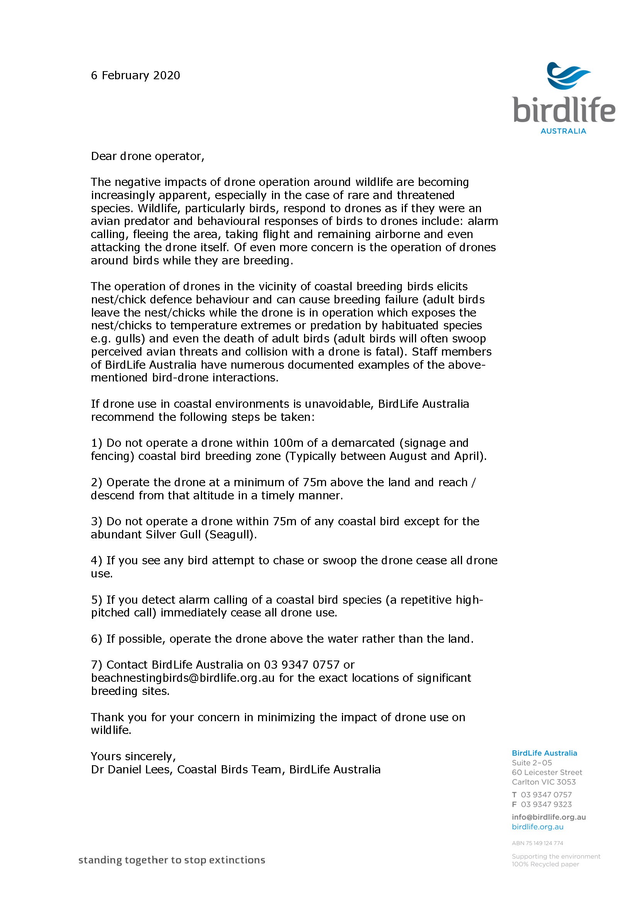

# NCDP Quick Reference Sheet

## Weather and tides

> **NOTE:** We do not map in temperatures \>35ºC, on days of Total Fire
> Ban, or on CATASTROPHIC Fire Danger days.
>
> Mapping needs to occur on the lowest tide possible. For the open
> coast, it must be under 1m for the entire mapping run (ideally under
> 0.9m), and for Port Phillip Bay under 0.5m for the entire mapping run.
> The wind needs to be under 15 knots, it needs to be daylight hours (at
> least 30 mins after first light) and it can’t be raining. On an ideal
> day, we will start mapping approximately 1.5-2 hours before low tide
> and work on the decreasing tide, through the low, and into the
> increasing tide.
>
> We recommend **www.WillyWeather.com.au** to check weather and tides.
> For wind, the arrows turn from green to blue once over 15 knots (which
> is 30 km/h):

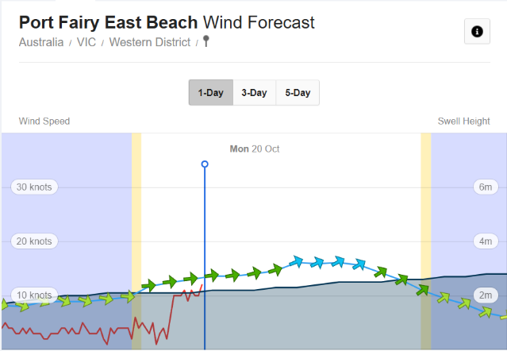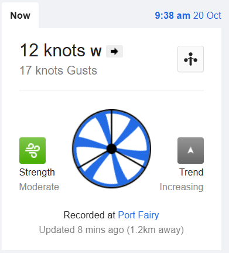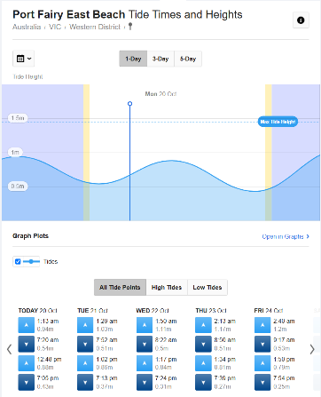

> The DJI Matrice 4 E controller will also warn you about wind. It will
> give you a “wind” warning at 10 knots of wind. However, a red “High
> Wind Warning” at 23 knots. If you are getting the “High Wind Warning”,
> you need to land.

## AeroPoints

>  alt="A yellow and black square with white text AI-generated content may be incorrect." />The
> AeroPoints need to be down for a **MINIMUM OF 10 MINUTES**. If you are
> unsure how long an AeroPoint has been recording (or if you want to
> confirm it is recording) you can use the “AeroPoints” app. It will
> find nearby AeroPoints (I think via Bluetooth) and display them on the
> screen and how long they have been recording.
>
> Remember the Hotspot for uploading data:
>
> Username: Propeller
>
> Password: propeller

## Missing Missions

There are 2 reasons why missions could be missing:

1)  The controller needs you to log-in to the account

    1.  The log-in details are on the back of the screen. You will need
        to have a Hotspot running to log-in.

> Username: <ncdp@deakin.edu.au>
>
> Password: 1234yolla

2)  They were accidently deleted

    1.  Please contact your Regional Representative

## Compass Calibration

> To calibrate the compass, go to the flying screen. Once there, toggle
> the flight mode switch back and forth 3 times quickly. This will enter
> the “Compass Calibration Mode”. Follow the instructions on the screen.

## Grid Vs Linear Missions

> The “Grid” missions are the default mission, and the one you should
> run when possible. However, if the beach has unavoidable people, you
> can run the 2 “Linear Missions” instead. Unlike the “Grid” mission,
> the “Linear” missions are set at least 30 m off the beach, and over
> the water. You must manually angle the camera at the beach after the
> first photo of the “Linear” mission (you can pause the mission to
> angle the camera), and ideally you do not want to catch the sky in the
> image. Please also note that there are 2 “Linear” mission for each
> mapping section (60 m and 80 m), and you must run both. You should be
> able to complete both on a single battery. This is quicker and more
> efficient for the battery.
>
> **NOTE:** “Grid” and “Linear” cover the same area on the ground for a
> single flight, so they are interchangeable during a mapping run. For
> instance, if you beach had 5 flights, you could do flight 1 and 2 as
> “Grid”, then flight 3 as “Linear” due to people, and flight 4 and 5 as
> “Grid”, and this would not effect the processing. It is best to do as
> many flights as “Grid” as possible (subject to the regulations), as
> the resultant data is better.

## Oblique Missions

> If your site/Controller has “Oblique” missions, these are run
> additional to a “Grid” mission to collect more comprehensive data on a
> vertical surface, like a cliff. Most sites do not have “Oblique”
> missions. They run like a “Linear” mission, but only at 1 height. You
> do not need to perform the “Oblique” mission if you ran the “Linear”
> mission for a location.

## Minimum Number of Citizen Scientists

> To operate independently, you must have at least 2 people who are
> listed on the Job Safety Plan as either “Trained Pilots-in-command and
> operation coordinators” or “Trained Spotters”, and at least 1 must be
> a “Trained Pilots-in-command and operation coordinators”. If you do
> not have the required Citizen Scientists, please inform the Deakin
> University Science Team, and they will assist you.

## What if the AeroPoint Light Isn’t On When I Go To Pick It Up?

> Please re-fly the mission if it is the local AeroPoint. If it is the
> AeroPoint which should have been recording the whole time, we can
> process the data without it, as long as the local AeroPoint worked for
> each mission and recorded at least 10 minutes.

## Battery Limits

100% = Full

65% = Half-Full

30% = Return and land (controller beeping)

\< 20% = Dangerous, must land

## Incident and Accident Response

1.  Ensure your own safety and the safety of those around you

2.  Apply first aid if needed

3.  Seek assistance if necessary

4.  Notify emergency services if necessary (000)

5.  Call Lachlan Howell (Deakin University Chief Remote Pilot) on 0431
    289 420 – he will inform next steps regarding the matter.

## Personal Hotspot

> Please run a Personal Hotspot during operations. This will provide you
> with maps AND provide more accurate location data on the images.
> Unless a different Hotspot has been configured for your drone, please
> use:
>
> Username: Propeller
>
> Password: propeller

## The transmitter is beeping constantly after turning it on.

> This is usually because one of the control sticks wasn’t in the
> neutral position (centre) when the controller was turned on. Turn the
> controller off, wait 5 seconds, and turn it back on, being careful not
> to touch the control sticks.

## The drone keeps stopping and starting along the transect line in the air.

There are 2 possibilities for this:

1)  The collision avoidance is stopping the drone. If there is no
    obstruction, this sometimes occurs because of the position of the
    sun directly in front of the drone. You can shift the flight lines
    and restart the mission is if keeps happening, or wait 15 minutes.

2)  The wind is near the maximum the airframe can operate in, and the
    angle of the flight line is directly in line with the wind. If you
    are SURE that the wind is under 15 knots, change the flight line by
    30 degrees and try the mission again.

## The drone says “No SD Card”, but has an SD card in it.

> This is usually due to an error on the SD card. Insert another SD
> card, and see if the error disappears. When you return home, remove
> all the data from the faulty card and format it. If possible, check
> the faulty card in the field as it may have corrupted mid-mission and
> not correctly recorded the previous mission.

## The drone won’t fly in a certain direction (i.e. forward).

> This is likely due to something being stuck over the collision
> avoidance sensor. Return to your home point by rotating the airframe
> and retiring in a direction the airframe will fly (i.e. backwards if
> it won’t go forwards). Make sure there is nothing covering one of the
> collision avoidance sensors. If you cannot see anything obvious, cease
> operations for the day and contact your regional co-ordinator.

## The controller keeps saying that the flight mission is too far.

> The drones for the NCDP have a maximum flight distance of 600 m from
> the take-off point (provided the GPS is operational). If you are
> getting this error, move closer to the centre of your flight area, or
> reduce t’s length. Conversely, you may have loaded the incorrect
> mission.

## One of my batteries will not charge.

> If a battery is drained below 20%, or detects an issue with the
> battery cells, it may refuse to charge when it is connected to the
> charger. Please do not try to fix this yourself. Instead, please
> contact your regional co-ordinator.

## The drone successfully completed the mapping, but it’s now hovering 1-2 m off the ground and won’t land.

> The most common reason this occurs is that the airframe has detected
> an obstacle in the landing area. This can also sometimes occur when
> there has been a large pressure change while the drone has been in the
> air. The altimeter on board uses air pressure to tell the height of
> the drone, but if there is a large atmospheric pressure change while
> it’s flying, the drone will misread where the ground should be. The
> reason the drone is hovering is that it has got to where it though
> ground should be, but it hasn’t registered landing.
>
> If you look at the screen there will be an option to “Force Land”. If
> there isn’t an impeding obstacle, select “Force Land”. If there is an
> obstacle, take manual control, move to a safe location and manually
> land.
